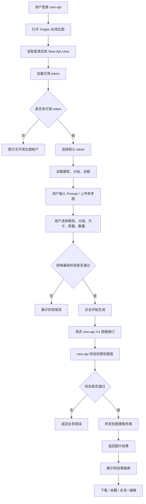
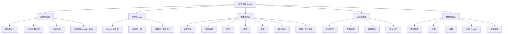
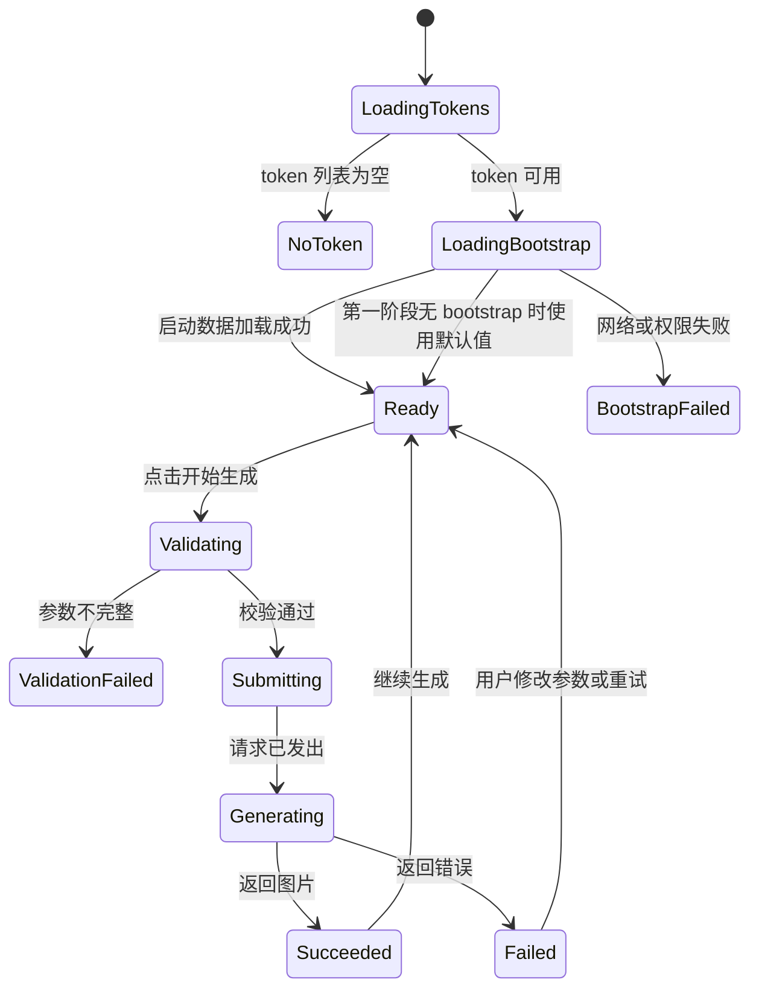

# 在线生图工作台详细设计文档

## 1. 结论

本文档定义 `gpt-image-playground` 与 `new-api` 深度集成后的详细产品与技术设计。

确认后的方案是：

- 新建详细设计文档，不覆盖现有简版文档。
- 复用当前 `new-api` 已有在线生图访问路径：`/imgen`。
- 第一阶段复用现有接口完成上线。
- 第二阶段新增聚合接口：`GET /api/image-playground/bootstrap`。
- 第一版只展示余额、倍率和错误原因，不强制做生成结果到日志的直接关联。
- 日志跳转、实际消耗明细、生成记录关联放到后续阶段。

产品定位保持不变：

> 在线生图工作台不是通用 API Playground，而是 `new-api` 面向站内买量用户的官方生图入口。

## 2. 背景

当前仓库里有两个相关项目：

- `new-api`：负责用户、登录态、额度、分组、模型权限、token、OpenAI 兼容转发、计费和日志。
- `gpt-image-playground`：负责图片生成体验，包括 Prompt、参考图、参数、图片结果、下载、收藏、复用和编辑。

现有 `gpt-image-playground` 已经具备接入 `new-api` 的基础能力：

- `VITE_ENABLE_NEW_API`
- `/api/token/`
- `/api/token/batch/keys`
- `New-Api-User` 请求头
- 同域 cookie
- `VITE_DEFAULT_API_URL`
- `VITE_SHOW_DEFAULT_CONFIG_ONLY`
- `VITE_RETURN_BASE_URL`

因此本次设计不做从零接入，也不重写生图链路。重点是把已有能力收敛成 `new-api` 内部可控、买量用户易用的工作台。

## 3. 目标用户

主要用户：

- 已登录 `new-api` 的普通用户。
- 已在站内购买额度的用户。
- 需要在线生成图片，但不理解或不关心 API Key、Base URL、Profile、服务商配置的用户。
- 关注生成效果、余额消耗、失败原因和结果下载的用户。

非主要用户：

- 渠道管理员。
- 模型供应商接入人员。
- API 开发者。
- 需要节点式工作流的专业图像工作流用户。
- 需要自定义 Provider 的高级调试用户。

## 4. 产品目标

### 4.1 第一阶段目标

第一阶段目标是让买量用户能从 `new-api` 后台直接完成图片生成。

必须做到：

- 用户从现有 `/imgen` 入口进入在线生图。
- 用户不需要填写 API Key。
- 用户不需要填写 Base URL。
- 用户不需要管理 Profile。
- 页面自动使用当前登录用户的可用 token。
- 默认请求当前站点 `/v1`。
- 用户可以输入 Prompt。
- 用户可以上传参考图。
- 用户可以选择基础生图参数。
- 用户可以生成、查看、下载、收藏、复用图片。
- 失败时展示能被普通用户理解的业务错误。

### 4.2 第二阶段目标

第二阶段目标是让页面真正感知当前用户的权限和额度。

必须做到：

- 只展示当前用户可用模型。
- 只展示当前用户可用分组。
- 展示当前账户余额。
- 展示模型倍率和分组倍率。
- 提供轻量预计消耗。
- 余额不足、模型不可用、分组不可用、Key 不可用时给出明确提示。
- 新增 `GET /api/image-playground/bootstrap` 聚合接口，减少前端拼装。

### 4.3 第三阶段目标

第三阶段目标是补齐运营、客服和排查能力。

建议做到：

- 生成完成后展示实际消耗。
- 支持跳转到相关用量日志。
- 支持一键创建生图专用 Key。
- 管理员可配置默认模型、默认分组、默认参数。
- 管理员可控制在线生图入口是否开放。

## 5. 非目标范围

第一版明确不做：

- 不重写 `gpt-image-playground` UI。
- 不重写 OpenAI 兼容 Images API 请求链路。
- 不做 ComfyUI 式节点工作流。
- 不做独立计费系统。
- 不在前端复制后端计费引擎。
- 不做复杂任务队列。
- 不做多租户素材库。
- 不做团队协作空间。
- 不做自定义 Provider 构建器。
- 不强制把结果与某条日志记录一一绑定。

跳过这些，是因为当前最短路径是把已有可用能力变成站内入口，而不是重新造一套图像平台。

## 6. 产品形态

### 6.1 访问路径

复用当前已有在线生图访问路径：

```text
/imgen
```

现有 `new-api` 前端已经存在 `/imgen` 侧边栏入口，因此第一版不新增 `/image-playground` 或复用聊天 Playground 路由。

这样做的好处：

- 不增加用户认知。
- 不引入路由迁移。
- 不破坏现有侧边栏模块配置。
- 不需要额外处理旧链接跳转。

### 6.2 菜单位置

沿用当前侧边栏中在线生图入口。

建议最终展示为：

```text
AI 能力
- 在线生图
```

当前侧边栏已有 `Online Image Generation` 入口，URL 为 `/imgen`，并标记为 `native: true`。第一阶段复用该入口，不占用聊天 Playground 的 `/playground` 语义。

### 6.3 部署形态

推荐部署方式：

```text
new-api 同域挂载 gpt-image-playground 构建产物
```

第一版不推荐 iframe。

原因：

- 同域挂载更容易复用 cookie 和 `New-Api-User`。
- 文件上传和拖拽体验更稳定。
- 移动端滚动和高度更可控。
- 顶部返回和浏览器历史更自然。
- 后续接入统一菜单、主题、错误页更简单。

## 7. 用户流程

### 7.1 正常流程

```text
用户登录 new-api
-> 进入 /imgen 在线生图
-> 页面读取当前用户登录态
-> 页面加载可用 token
-> 页面选择默认 token
-> 页面加载或使用默认模型、分组和参数
-> 用户输入 Prompt
-> 用户按需上传参考图
-> 用户选择模型、分组、尺寸、质量、数量
-> 用户点击开始生成
-> 前端使用 token 请求 /v1/images/generations 或 /v1/images/edits
-> new-api 校验 token、模型、分组、额度
-> new-api 转发到对应渠道
-> new-api 扣费并记录用量
-> 前端展示生成结果
-> 用户下载、收藏、复用或继续编辑
```

### 7.2 用户流程图



### 7.3 异常流程

无可用 token：

```text
页面加载 token 列表为空
-> 展示空状态
-> 提示“当前账户没有可用生图账户”
-> 引导用户创建 Key 或联系管理员
```

余额不足：

```text
用户点击生成
-> 后端返回余额不足
-> 前端展示“余额不足，无法生成图片，请充值后重试”
-> 提供“去充值”入口
```

模型不可用：

```text
模型列表加载后不包含上次选择的模型
-> 自动切换到默认可用模型
-> 提示“你当前无权使用原模型，已切换到默认可用模型”
```

分组不可用：

```text
分组列表加载后不包含上次选择的分组
-> 自动切换到 token 所属分组或用户默认分组
-> 提示“当前分组不可用，已切换到可用分组”
```

服务商失败：

```text
new-api 转发失败或渠道返回错误
-> 前端展示“图片生成失败，服务商返回错误：{message}”
-> 技术详情折叠展示
```

## 8. 页面设计

### 8.1 页面原则

页面应该像后台工作台，不像营销页。

设计原则：

- Prompt 和生成按钮优先级最高。
- 余额、账户、模型、分组必须明确。
- 普通用户不看到 API 配置。
- 参数控制稳定、密度适中、便于重复使用。
- 错误提示讲业务含义，不先讲技术细节。
- 结果区域以图片为中心。

### 8.2 页面信息架构



### 8.3 桌面端线框图

```text
+--------------------------------------------------------------------------------------------------+
| Sidebar | 在线生图                                             余额: 1280 点    返回控制台       |
|         | 当前账户: 生图 Key A / default 组                                                       |
+--------------------------------------------------------------------------------------------------+
|                                                                                                  |
|  Prompt                                                                                          |
|  +--------------------------------------------------------------------------------------------+  |
|  | 描述你想生成的图片...                                                                      |  |
|  |                                                                                            |  |
|  +--------------------------------------------------------------------------------------------+  |
|                                                                                                  |
|  参考图                                                                                          |
|  +------------------+  +------------------+  +------------------+  +----------------------+    |
|  | 上传参考图       |  | 已上传图片 1     |  | 已上传图片 2     |  | 编辑 / 蒙版          |    |
|  +------------------+  +------------------+  +------------------+  +----------------------+    |
|                                                                                                  |
|  参数                                                                                            |
|  +----------------+ +----------------+ +--------------+ +--------------+ +------------------+   |
|  | 模型           | | 分组           | | 尺寸         | | 质量         | | 数量             |   |
|  | gpt-image-1    | | default        | | 1024x1024    | | high         | | 1                |   |
|  +----------------+ +----------------+ +--------------+ +--------------+ +------------------+   |
|                                                                                                  |
|  模型倍率 x1.0 · 分组倍率 x1.0                      预计消耗: 约 40 点      [开始生成]          |
|                                                                                                  |
+--------------------------------------------------------------------------------------------------+
|  结果画廊                                                                                         |
|  +---------------------+ +---------------------+ +---------------------+ +--------------------+  |
|  | 结果图 1            | | 结果图 2            | | 结果图 3            | | 结果图 4           |  |
|  |                     | |                     | |                     | |                    |  |
|  | 下载 收藏 复用 编辑 | | 下载 收藏 复用 编辑 | | 下载 收藏 复用 编辑 | | 下载 收藏 复用 编辑|  |
|  +---------------------+ +---------------------+ +---------------------+ +--------------------+  |
+--------------------------------------------------------------------------------------------------+
```

### 8.4 移动端线框图

```text
+--------------------------------------+
| <- 返回   在线生图      余额 1280 点 |
| 当前账户: 生图 Key A / default       |
+--------------------------------------+
| Prompt                               |
| +----------------------------------+ |
| | 描述你想生成的图片...            | |
| +----------------------------------+ |
| 参考图  [ + ]                       |
|                                      |
| 模型        [ gpt-image-1        v ] |
| 分组        [ default            v ] |
| 尺寸        [ 1024x1024          v ] |
| 质量        [ high               v ] |
| 数量        [ 1                  v ] |
|                                      |
| 倍率: 模型 x1.0 / 分组 x1.0          |
| 预计消耗: 约 40 点                   |
| [            开始生成              ] |
+--------------------------------------+
| 结果                                 |
| +----------------------------------+ |
| | 图片 1                           | |
| +----------------------------------+ |
| 下载  收藏  复用  编辑              |
| +----------------------------------+ |
| | 图片 2                           | |
| +----------------------------------+ |
| 下载  收藏  复用  编辑              |
+--------------------------------------+
```

### 8.5 普通用户可见控件

普通买量用户可见：

- 在线生图标题。
- 返回控制台。
- 当前余额。
- 当前账户或 token 名称。
- 当前分组。
- Prompt 输入。
- 参考图上传。
- 模型选择。
- 分组选择。
- 尺寸选择。
- 质量选择。
- 数量选择。
- 输出格式。
- 倍率或预计消耗。
- 开始生成按钮。
- 结果画廊。
- 下载。
- 收藏。
- 复用 Prompt。
- 继续编辑。

### 8.6 普通用户隐藏控件

`new-api mode` 下隐藏：

- API Base URL。
- 手动 API Key。
- Profile 管理。
- Profile 导入/导出。
- 服务商切换。
- 自定义 Provider。
- 代理配置。
- API 调试选项。
- 开发者高级选项。

这些能力不是删除，而是在 `new-api mode` 下隐藏。管理员或调试环境可保留入口。

## 9. 前端设计

### 9.1 模式定义

新增或沿用 `new-api mode`。

推荐环境变量：

```env
VITE_ENABLE_NEW_API=true
VITE_SHOW_DEFAULT_CONFIG_ONLY=true
VITE_DEFAULT_API_URL=/v1?apiMode=images
VITE_RETURN_BASE_URL=/dashboard/overview
```

运行时环境变量继续支持对应无 `VITE_` 前缀的 Docker 注入：

```env
ENABLE_NEW_API=true
SHOW_DEFAULT_CONFIG_ONLY=true
DEFAULT_API_URL=/v1?apiMode=images
RETURN_BASE_URL=/dashboard/overview
BASE_TITLE=轻云
BASE_LOGO_URL=
```

### 9.2 前端启动状态

页面启动状态：

```text
idle
-> loading_auth
-> loading_tokens
-> loading_bootstrap
-> ready
```

失败状态：

```text
unauthorized
no_token
bootstrap_failed
network_failed
```

### 9.3 前端生成状态

生成状态：

```text
idle
-> validating
-> submitting
-> generating
-> succeeded
```

失败状态：

```text
validation_failed
quota_failed
permission_failed
provider_failed
network_failed
unknown_failed
```

### 9.4 状态流转图



### 9.5 token 选择策略

第一阶段复用现有逻辑：

```text
GET /api/token/?p=1&size=10
POST /api/token/batch/keys
```

选择规则：

1. 只使用 `status === 1` 的 token。
2. 优先使用用户上次选择的 token。
3. 上次 token 不可用时，选择第一个有效 token。
4. token 名称为空时显示 `Key {id}`。
5. UI 不展示完整 key，只展示名称、分组和掩码。
6. 如果没有有效 token，进入 `no_token` 状态。

### 9.6 三层展开结构

在线生图入口的选择器改为三层逐级展开结构：

```text
第 1 层：API Key
第 2 层：该 Key 所属分组
第 3 层：该分组下去重后的图片模型
```

设计原则：

- 复用当前 `gpt-image-playground` 的轻量渲染风格。
- 不暴露渠道这一后端调度层概念。
- 不把同一个模型因多个渠道重复展示给用户。
- 只有最后一层模型点击时才真正替换配置。

### 9.7 第 1 层：API Key

每个 Key 节点展示：

- Key 名称。
- 掩码 key。
- token.group。
- model_limits 摘要。
- 可用状态。

状态规则：

- `status !== 1` 的 token 不进入列表。
- 没有真实 key 的 token 置灰。
- 该 Key 所属分组下没有任何图片模型时，Key 节点置灰。

交互规则：

- 点击第 1 层只负责展开，不直接替换 active profile。
- 默认展开当前正在使用的 Key。

### 9.8 第 2 层：分组

第二层固定显示 Key 自己的 `token.group`，不扩展为用户所有可用分组。

原因：

- 更符合当前 token 的语义边界。
- 避免让用户误以为一个 Key 可以自由切换到别的 group。
- 与现有 relay 里的 token/group 权限关系一致。

每个分组节点展示：

- 分组名。
- 分组倍率。
- 该分组下可用图片模型数量。
- 可用状态。

状态规则：

- 分组不在当前用户可用分组列表中时置灰。
- 分组下去重后没有图片模型时置灰。
- 分组下模型全部被 `token.model_limits` 过滤掉时置灰。

交互规则：

- 点击第 2 层只展开，不直接替换 active profile。
- 默认展开当前 Key 所属分组。

### 9.9 第 3 层：分组下去重图片模型

第三层展示该分组下去重后的图片模型列表。

模型来源：

```text
/api/user/models?group={token.group}
```

去重规则：

```text
分组下所有图片模型做并集
-> 按模型名去重
-> 再按 token.model_limits 二次过滤
-> 过滤后为空则该分组置灰
```

图片模型判定规则建议：

```text
model startsWith "gpt-image-"
or model startsWith "dall-e"
or model contains "imagen"
or model contains "image"
or backend explicitly marks type = "image"
```

长期更稳的方式仍然是后端返回 `type: "image"`。

每个模型节点展示：

- 模型名。
- 模型倍率。
- 是否可用。

状态规则：

- 非图片模型不展示。
- 被 `token.model_limits` 排除的模型置灰。
- 当前 group 下不可用的模型不展示。

点击行为：

```text
点击第 3 层模型
-> 写入 apiKey
-> 写入 model
-> 写入 group
-> 写入 profile.name
-> 固定 apiMode=images
-> 固定 baseUrl=/v1
```

建议 profile 命名：

```text
{key.name} / {group} / {model}
```

### 9.10 模型选择策略

第一阶段：

- 可先使用默认模型。
- 默认模型来自 `VITE_DEFAULT_API_URL` 的 `model` 参数或前端默认值。
- 如果没有可用模型接口，则不阻塞生成。

第二阶段：

- 通过 bootstrap 或 `/api/user/models` 获取当前用户可用模型。
- 只展示图像模型。
- 当前选中模型不在可用列表中时，自动切换到第一个可用图像模型。

图像模型筛选规则建议：

```text
model startsWith "gpt-image-"
or model startsWith "dall-e"
or model contains "imagen"
or model contains "image"
or backend explicitly marks type = "image"
```

更稳的长期方案是后端返回 `type: "image"`，前端不做字符串猜测。

### 9.11 分组选择策略

第一阶段：

- 默认使用 token 的 `group`。
- token group 为空时使用 `default`。

第二阶段：

- 通过 bootstrap 或 `/api/user/self/groups` 获取当前用户可用分组。
- 不再提供自由分组下拉。
- 分组来源固定为 token.group。
- `/api/user/self/groups` 用于校验 token.group 是否仍对当前用户可用。
- 如果 token.group 不可用，则整个 Key 节点置灰。

### 9.12 参数策略

第一阶段支持：

- `prompt`
- `image`
- `mask`
- `model`
- `size`
- `quality`
- `n`
- `output_format`

参数默认值：

```text
apiMode: images
model: gpt-image-1 或现有默认模型
group: token.group || default
size: 1024x1024
quality: auto
n: 1
output_format: png
```

具体可选项优先复用 `gpt-image-playground` 现有参数配置，不新增复杂参数系统。

### 9.13 生成前校验

前端只做体验校验，不做最终权限判断。

校验项：

- Prompt 不能为空。
- 至少有一个有效 token。
- 至少有一个可展开分组。
- 模型不能为空。
- 分组不能为空。
- 图片编辑模式下至少有一张参考图。
- 数量必须在允许范围内。
- 尺寸必须在当前模型支持范围内。
- 如果已知余额为 0，则生成按钮禁用。

最终权限和扣费以后端为准。

### 9.14 替换逻辑

当前 `gpt-image-playground` 的替换逻辑是：

```text
选中 Key
-> applyNewApiKeyToActiveProfile()
-> 只替换 apiKey 和 profile.name
```

调整后改为：

```text
选中第 3 层模型
-> 写入 apiKey
-> 写入 model
-> 写入 group
-> 写入 profile.name
-> 固定 apiMode=images
-> 固定 baseUrl=/v1
```

建议新增一个面向三层结构的替换函数，例如：

```text
applyNewApiSelectionToActiveProfile(settings, {
  key,
  group,
  model
})
```

职责：

- 保留 active profile 其他兼容配置。
- 更新 `apiKey`。
- 更新 `model`。
- 更新 `apiMode`。
- 更新 `baseUrl`。
- 让 profile 名称体现 `Key / 分组 / 模型`。

### 9.15 错误展示策略

错误展示顺序：

1. 优先展示 `new-api` 返回的业务 message。
2. 如果有服务商原始 message，展示在业务文案后。
3. HTTP 状态码、request id、渠道错误等放到折叠详情中。

错误示例：

```text
余额不足
当前账户余额不足，无法生成图片。请充值后重试。

没有可用生图账户
当前账户没有可用生图账户，请先创建 Key 或联系管理员。

模型不可用
你当前无权使用该模型，已切换到默认可用模型。

分组不可用
当前分组不可用，已切换到可用分组。

服务商失败
图片生成失败，服务商返回错误：{message}
```

## 10. 后端设计

### 10.1 第一阶段复用接口

第一阶段复用：

```http
GET /api/token/?p=1&size=10
POST /api/token/batch/keys
GET /api/user/self
GET /api/user/models
GET /api/user/self/groups
POST /v1/images/generations
POST /v1/images/edits
```

其中：

- `/api/token/` 用于读取当前用户 token 列表。
- `/api/token/batch/keys` 用于批量获取当前用户 token 真实 key。
- `/api/user/self` 用于读取用户余额、基础信息和侧边栏配置。
- `/api/user/models` 用于读取当前用户可用模型。
- `/api/user/self/groups` 用于读取当前用户可用分组。
- `/v1/images/generations` 用于文生图。
- `/v1/images/edits` 用于图像编辑。

### 10.2 第二阶段新增聚合接口

新增：

```http
GET /api/image-playground/bootstrap
```

鉴权：

```text
UserAuth()
```

用途：

- 减少前端多接口拼装。
- 后端统一处理用户、token、分组、去重图片模型和默认值。
- 给在线生图提供稳定启动数据。

### 10.3 bootstrap 响应结构

建议响应：

```json
{
  "success": true,
  "data": {
    "user": {
      "id": 1,
      "username": "user",
      "display_name": "用户",
      "quota": 10000,
      "used_quota": 1200,
      "request_count": 38
    },
    "tokens": [
      {
        "id": 12,
        "name": "生图 Key",
        "group": "default",
        "model_limits_enabled": false,
        "model_limits": "",
        "remain_quota": 0,
        "unlimited_quota": true,
        "used_quota": 200,
        "masked_key": "sk-xxx...abcd",
        "disabled": false,
        "groups": [
          {
            "name": "default",
            "display_name": "默认分组",
            "ratio": 1,
            "disabled": false,
            "models": [
              {
                "id": "gpt-image-1",
                "name": "gpt-image-1",
                "type": "image",
                "ratio": 1,
                "disabled": false
              }
            ]
          }
        ]
      }
    ],
    "defaults": {
      "token_id": 12,
      "group": "default",
      "model": "gpt-image-1",
      "api_mode": "images",
      "size": "1024x1024",
      "quality": "auto",
      "n": 1,
      "output_format": "png"
    },
    "features": {
      "show_quota": true,
      "show_estimated_cost": true,
      "allow_model_select": true,
      "allow_manual_api_config": false
    }
  }
}
```

### 10.4 bootstrap 字段说明

`user`：

- 当前登录用户基础信息。
- `quota` 是当前剩余额度。
- `used_quota` 是历史已用额度。

`tokens`：

- 当前用户可用于生图的 token。
- 不返回完整 key。
- 第一阶段真实 key 仍由 `/api/token/batch/keys` 获取。
- 每个 token 节点内嵌三层结构所需的 `groups`。
- 第二阶段如需更安全，可让前端不接触真实 key，改由后端直接代理请求。但这不是第一版目标。

`tokens[].groups`：

- 当前 token 可展开的分组列表。
- 按确认方案，第一版只返回 `token.group` 对应的一个分组节点。
- `ratio` 用于展示分组倍率。
- `models` 为该分组下去重后的图片模型列表。

`tokens[].groups[].models`：

- 当前分组下去重后的图像模型。
- `type` 建议后端明确返回 `image`。
- `ratio` 用于展示模型倍率。
- `disabled` 用于前端逐级置灰。

`defaults`：

- 页面首次进入时的默认选择。

`features`：

- 控制普通用户可见能力。
- 第一版重点是 `allow_manual_api_config: false`。

### 10.5 bootstrap 降级策略

如果第二阶段接口暂未实现，前端按第一阶段逻辑降级：

```text
bootstrap 请求失败
-> 不阻塞页面
-> 使用 /api/token/ 和 /api/token/batch/keys
-> 使用默认模型和 token.group
-> 隐藏无法确认的倍率和预计消耗
```

## 11. 权限与安全边界

### 11.1 后端必须保证

后端是最终权限源。

必须保证：

- 用户只能读取自己的 token。
- 用户只能批量获取自己的 token key。
- 用户只能使用自己可用的分组。
- 用户只能使用自己可用的模型。
- token 的模型限制必须生效。
- token 的分组限制必须生效。
- 用户余额不足时不能继续扣费生成。
- 实际扣费以后端 relay 结果为准。
- 所有 `/v1/images/*` 请求必须经过现有 relay 鉴权、分发和计费链路。

### 11.2 前端只负责体验

前端负责：

- 隐藏不该让普通用户看到的配置项。
- 提前做空值和明显错误校验。
- 展示可理解的错误文案。
- 展示余额、倍率、预计消耗。

前端不负责：

- 最终鉴权。
- 最终模型权限判断。
- 最终分组权限判断。
- 最终扣费。
- 防止恶意请求。

### 11.3 Key 暴露边界

现有实现会通过 `/api/token/batch/keys` 让前端拿到真实 key，以便请求 `/v1`。

第一阶段接受该实现，因为它已经按当前用户过滤，且是现有联动基础。

长期更安全的方案：

```text
前端不接触真实 key
-> 前端选择 token_id
-> 请求 new-api 内部生图代理接口
-> 后端用 token_id 完成 relay
```

但这会改动生图请求链路，第一版不做。

## 12. 计费与额度展示

### 12.1 第一阶段展示

第一阶段展示：

- 当前余额。
- 当前模型倍率。
- 当前分组倍率。
- 生成按钮附近的简单提示。

示例：

```text
余额：1280 点
模型倍率：x1.0
分组倍率：x1.0
预计消耗：按实际生成结果扣费
```

### 12.2 第二阶段预计消耗

第二阶段可展示轻量预计消耗：

```text
预计消耗 = 基础消耗 * 模型倍率 * 分组倍率 * 数量
```

注意：

- 预计消耗只是提示。
- 实际消耗以后端日志和扣费结果为准。
- 不在前端复制完整计费规则。
- 如果无法准确计算，显示倍率，不显示确定数值。

### 12.3 完成后实际消耗

第三阶段做：

- 生成完成后展示实际消耗。
- 可选展示 request id。
- 可选提供日志跳转。

第一版不强制做。

## 13. 日志与可观测性

### 13.1 第一阶段

第一阶段不强制把前端结果和某条日志绑定。

原因：

- 生图请求已经经过 `new-api` relay。
- 后端已有用量日志基础。
- 结果与日志的强绑定需要 request id、响应结构和日志查询条件进一步统一。

第一阶段只要求：

- 请求失败时保留错误 message。
- 技术详情可折叠展示。
- 如果响应里有 request id，则展示但不强依赖。

### 13.2 第二/三阶段

后续补：

- 请求发起时记录 client request id。
- 后端日志记录 client request id。
- 前端结果保存 request id。
- 结果卡片提供“查看用量日志”。
- 客服可通过 request id 查询失败原因。

## 14. 配置设计

### 14.1 前端构建配置

推荐：

```env
VITE_ENABLE_NEW_API=true
VITE_SHOW_DEFAULT_CONFIG_ONLY=true
VITE_DEFAULT_API_URL=/v1?apiMode=images
VITE_RETURN_BASE_URL=/dashboard/overview
VITE_BASE_TITLE=轻云
VITE_BASE_LOGO_URL=
```

### 14.2 Docker 运行时配置

推荐：

```env
ENABLE_NEW_API=true
SHOW_DEFAULT_CONFIG_ONLY=true
DEFAULT_API_URL=/v1?apiMode=images
RETURN_BASE_URL=/dashboard/overview
BASE_TITLE=轻云
BASE_LOGO_URL=
```

### 14.3 管理员配置

第一阶段不新增复杂管理页。

第二/三阶段可在系统设置中加入：

```text
online_image_enabled: true
online_image_default_model: gpt-image-1
online_image_default_group: default
online_image_show_estimated_cost: true
online_image_allow_model_select: true
```

是否落库和命名以后端现有系统设置方式为准。

## 15. 文案设计

### 15.1 名称

统一名称：

```text
在线生图
```

不要使用：

```text
Playground
API Playground
GPT Playground
调试台
```

### 15.2 关键按钮

推荐文案：

```text
开始生成
重新生成
下载
收藏
复用 Prompt
继续编辑
去充值
创建生图账户
返回控制台
```

### 15.3 空状态

无 token：

```text
当前账户没有可用生图账户
请先创建 Key，或联系管理员为你开通在线生图权限。
```

无结果：

```text
还没有生成结果
输入 Prompt 后点击开始生成，结果会显示在这里。
```

无模型：

```text
当前账户没有可用生图模型
请切换账户、分组，或联系管理员开通模型权限。
```

### 15.4 错误文案

余额不足：

```text
余额不足，无法生成图片
请充值后重试。
```

Key 无效：

```text
当前生图账户不可用
请切换账户，或重新创建 Key。
```

模型无权限：

```text
你当前无权使用该模型
请选择其他可用模型。
```

分组无权限：

```text
当前生图账户所属分组不可用
请切换其他 Key，或联系管理员检查分组权限。
```

渠道失败：

```text
图片生成失败
服务商返回错误：{message}
```

## 16. 研发拆分

### 16.1 第一阶段：入口可用

目标：

```text
买量用户能通过 /imgen 免配置完成生图。
```

任务：

- 确认 `/imgen` 入口文案为“在线生图”。
- 启用 `VITE_ENABLE_NEW_API=true`。
- 启用 `VITE_SHOW_DEFAULT_CONFIG_ONLY=true`。
- 默认 `VITE_DEFAULT_API_URL=/v1?apiMode=images`。
- 固定返回 `/dashboard/overview`。
- 隐藏普通用户 API 配置入口。
- 自动读取 token 并选择默认 token。
- 无 token 时展示空状态。
- 生成失败时展示 `new-api` 业务错误。

验收：

- 登录用户进入 `/imgen` 后无需填写 key。
- 登录用户无需填写 Base URL。
- 至少一个有效 token 时可以发起生图。
- 无有效 token 时不展示技术配置页。
- 返回按钮回到 `/dashboard/overview`。

### 16.2 第二阶段：权限感知

目标：

```text
页面只展示用户有权使用的模型和分组。
```

任务：

- 新增 `GET /api/image-playground/bootstrap`。
- 返回用户、`Key -> 分组 -> 去重图片模型` 三层树、默认值。
- 前端优先使用 bootstrap。
- bootstrap 失败时降级到第一阶段逻辑。
- 模型选择过滤为图像模型。
- 分组只显示 token.group，并校验其是否仍对用户可用。
- 展示余额和倍率。
- 余额为 0 时禁用生成或给明确提示。

验收：

- 用户看不到无权使用的模型。
- 用户看不到无权使用的分组。
- 同一分组下重复图片模型只展示一次。
- 只有点击第 3 层模型时才真正替换配置。
- 当前模型不可用时自动切换到可用默认模型。
- 当前分组不可用时对应 Key 节点置灰。

### 16.3 第三阶段：计费和日志

目标：

```text
用户知道本次生成大概花多少，运营能追踪问题。
```

任务：

- 展示预计消耗。
- 生成完成后展示实际消耗。
- 记录 request id。
- 结果卡片支持跳转用量日志。
- 错误详情中展示 request id 和技术信息。

验收：

- 余额不足提示准确。
- 成功后能看到实际扣费或可跳转查看。
- 客服可通过 request id 查询对应日志。

## 17. 验收清单

### 17.1 产品验收

- 用户知道这是站内在线生图功能。
- 用户不需要理解 API Key。
- 用户不需要理解 Base URL。
- 用户不需要管理 Profile。
- 用户能看到余额或额度。
- 用户能知道失败原因。
- 用户能保存或复用生成结果。

### 17.2 前端验收

- `/imgen` 可访问。
- `new-api mode` 生效。
- API 配置入口对普通用户隐藏。
- token 自动加载。
- 默认 token 自动选择。
- 无 token 空状态正确。
- Prompt 为空不能提交。
- 图片编辑模式无参考图不能提交。
- 生成中按钮有 loading 状态。
- 错误 toast 或错误面板可读。
- 移动端按钮和文字不溢出。

### 17.3 后端验收

- `/api/token/` 只返回当前用户 token。
- `/api/token/batch/keys` 只返回当前用户 token key。
- `/v1/images/generations` 继续经过 relay 鉴权和计费。
- `/v1/images/edits` 继续经过 relay 鉴权和计费。
- bootstrap 接口启用 `UserAuth()`。
- bootstrap 不返回其他用户数据。
- bootstrap 不返回无权限模型和分组。

### 17.4 安全验收

- 未登录访问 `/imgen` 会进入登录流程。
- 无 `New-Api-User` 或 cookie 失效时不能获取 token。
- 普通用户不能通过前端选择无权限分组。
- 普通用户不能通过前端选择无权限模型。
- 即使用户篡改前端参数，后端仍会拦截无权限请求。

## 18. 风险与处理

### 18.1 前端仍能拿到真实 key

风险：

```text
现有联动通过 /api/token/batch/keys 让前端拿真实 key。
```

处理：

- 第一阶段接受，因为这是现有实现。
- 后端继续保证只能取当前用户 key。
- 长期可改为 token_id 代理模式。

### 18.2 模型类型靠字符串判断不稳

风险：

```text
只靠 gpt-image、dall-e、imagen 等字符串筛选可能误判。
```

处理：

- 第一阶段可接受字符串筛选。
- 第二阶段 bootstrap 返回 `type: "image"`。

### 18.3 预计消耗不准确

风险：

```text
图像模型计费可能受尺寸、质量、数量、渠道影响。
```

处理：

- 第一阶段只展示倍率。
- 第二阶段预计消耗标记为“约”。
- 实际扣费以后端为准。

### 18.4 `/imgen` 与 `/playground` 语义边界

风险：

```text
new-api 内部同时存在聊天 Playground 语义，因此在线生图应固定使用 `/imgen`，避免与 `/playground` 混淆。
```

处理：

- 第一阶段复用路径。
- UI 文案统一为“在线生图”。
- `/playground` 保留给聊天或模型调试场景。

## 19. 最小实现顺序

推荐最小实现顺序：

```text
1. 固定 /imgen 在线生图入口和文案
2. 启用 new-api mode
3. 隐藏普通用户 API 配置
4. 默认 /v1?apiMode=images
5. 自动加载 token
6. 无 token 空状态
7. 生成错误业务化展示
8. 展示余额
9. 接入模型和分组
10. 新增 bootstrap 聚合接口
11. 展示倍率和预计消耗
12. 日志跳转和实际消耗
```

不要先做：

```text
大规模 UI 重写
复杂工作流
完整任务系统
独立素材库
前端计费引擎
```

## 20. 最终判断

这次设计的核心不是“再做一个生图工具”，而是把已经可用的 `gpt-image-playground` 收敛成 `new-api` 站内买量用户的官方入口。

最小正确方案是：

```text
复用 /imgen
复用现有 token/key 接口
复用 /v1/images/*
隐藏开发者配置
补齐用户权限、余额、模型、分组和错误体验
```

第一版不追求大而全。先让买量用户能稳定生成图片，再逐步补计费明细、日志追踪和运营配置。
