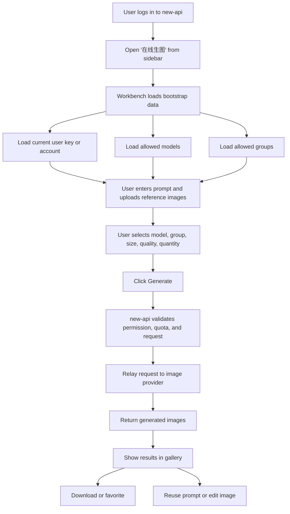
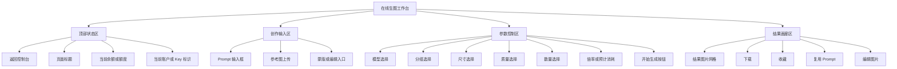

# Online Image Workbench

## Summary

This document defines the product direction for integrating `gpt-image-playground` into `new-api` as a first-class in-site image generation workspace for paid users.

The target is not a generic API playground. The target is a guided image console inside `new-api` for users who already buy quota on the site and expect to generate images without understanding API keys, base URLs, profiles, or provider wiring.

## Product Positioning

`Online Image Workbench` is a menu entry inside `new-api` for logged-in paid users.

Its single job is:

> Let a user enter a prompt, upload reference images if needed, pick a model and a group they are allowed to use, and generate images with their existing site balance.

## Target Users

Primary users:

- logged-in `new-api` users
- users who buy quota directly on the site
- users who care about results, cost, and speed rather than API setup

Non-primary users:

- API developers
- channel operators
- provider integrators
- advanced workflow users who want node-based generation tools

## Product Goals

### Phase 1 Goals

- add an `Online Image` entry into the `new-api` menu
- embed the current `gpt-image-playground` experience into the `new-api` product surface
- auto-use the current user's valid key
- default all requests to current-site `/v1`
- hide API configuration, profile management, base URL, and manual key input
- support prompt input, reference image upload, generation, download, and reuse

### Phase 2 Goals

- only show models the current user can actually use
- only show groups the current user can actually use
- show current balance or quota
- show model ratio, group ratio, or lightweight estimated cost
- improve business-facing error messages

### Phase 3 Goals

- connect generation results with `new-api` usage logs
- support jump to the related billing/log view
- support one-click creation of an image-specific key
- support admin-level feature switches and defaults

## Product Shape

Recommended shape:

- keep `gpt-image-playground` as a separately built frontend
- mount it under the same origin as `new-api`
- expose it as a native `new-api` menu destination

Recommended route:

```text
/image-playground
```

Recommended menu label:

```text
AI 能力 / 在线生图
```

This is preferred over an iframe. Same-origin mounted assets provide better session behavior, file upload behavior, mobile behavior, return navigation, and visual consistency.

## Core Experience

### User Flow

```text
Login to new-api
-> Open "在线生图" from the sidebar
-> Page loads current user bootstrap data
-> User enters a prompt
-> User optionally uploads reference images
-> User chooses model, group, size, quality, quantity
-> User clicks generate
-> new-api authenticates, relays, and bills
-> Result images appear in the gallery
-> User downloads, favorites, reuses, or edits
```

### User Flow Diagram



### Guided Experience Principles

- users should not see raw API configuration
- users should not need to paste keys
- users should not be allowed to choose models or groups they cannot use
- errors should be phrased in product language first, technical detail second
- cost visibility should be present near the generate action

## Information Architecture

### Visible Controls

- page title
- return to console
- current balance / quota
- current active account key label
- prompt input
- reference image upload
- model selector
- group selector
- size selector
- quality selector
- quantity selector
- generate button
- result gallery
- download / favorite / reuse / edit actions

### Hidden Controls in `new-api mode`

- base URL input
- manual API key input
- profile switching
- provider switching
- custom provider import/export
- proxy configuration
- advanced developer options

### Information Architecture Diagram



## UI Design Direction

Audience: paid in-site users inside an admin-like product.

The UI should feel:

- quiet
- focused
- dense enough for repeat use
- clearly part of `new-api`
- more workbench than marketing page

Recommended presentation:

- keep the current image-first gallery behavior
- compress setup controls into a stable parameter rail
- make prompt and generate action dominant
- keep balance and account state visible near the top
- avoid decorative hero sections

## Expected UI

### Desktop Wireframe

```text
+--------------------------------------------------------------------------------------------------+
| Sidebar | 在线生图                                              余额: 1280 点   返回控制台      |
|         | 当前账户: 生图 Key A / default 组                                                  |
+--------------------------------------------------------------------------------------------------+
|                                                                                                  |
|  Prompt                                                                                          |
|  +--------------------------------------------------------------------------------------------+  |
|  | 描述你想生成的图片...                                                                      |  |
|  |                                                                                            |  |
|  +--------------------------------------------------------------------------------------------+  |
|                                                                                                  |
|  参考图上传区                                                                                     |
|  +------------------+  +------------------+  +------------------+  +----------------------+    |
|  | 上传参考图       |  | 已上传图片 1     |  | 已上传图片 2     |  | 蒙版/编辑入口        |    |
|  +------------------+  +------------------+  +------------------+  +----------------------+    |
|                                                                                                  |
|  参数区                                                                                            |
|  +----------------+ +----------------+ +--------------+ +--------------+ +------------------+   |
|  | 模型           | | 分组           | | 尺寸         | | 质量         | | 数量             |   |
|  | gpt-image-1    | | default        | | 1024x1024    | | high         | | 1                |   |
|  +----------------+ +----------------+ +--------------+ +--------------+ +------------------+   |
|                                                                                                  |
|  当前倍率: 模型 x1.0 · 分组 x1.0                            预计消耗: 约 40 点   [开始生成]      |
|                                                                                                  |
+--------------------------------------------------------------------------------------------------+
|  结果画廊                                                                                         |
|  +---------------------+ +---------------------+ +---------------------+ +--------------------+  |
|  | 结果图 1            | | 结果图 2            | | 结果图 3            | | 结果图 4           |  |
|  |                     | |                     | |                     | |                    |  |
|  | 下载 收藏 复用 编辑 | | 下载 收藏 复用 编辑 | | 下载 收藏 复用 编辑 | | 下载 收藏 复用 编辑|  |
|  +---------------------+ +---------------------+ +---------------------+ +--------------------+  |
+--------------------------------------------------------------------------------------------------+
```

### Mobile Wireframe

```text
+--------------------------------------+
| <- 返回   在线生图      余额 1280 点 |
| 当前账户: 生图 Key A                |
+--------------------------------------+
| Prompt                               |
| +----------------------------------+ |
| | 描述你想生成的图片...            | |
| +----------------------------------+ |
| 上传参考图  [ + ]                   |
|                                      |
| 模型        [ gpt-image-1        v ] |
| 分组        [ default            v ] |
| 尺寸        [ 1024x1024          v ] |
| 质量        [ high               v ] |
| 数量        [ 1                  v ] |
|                                      |
| 当前倍率: x1.0 / x1.0                |
| 预计消耗: 约 40 点                    |
| [            开始生成              ] |
+--------------------------------------+
| 结果                                 |
| +----------------------------------+ |
| | 图片 1                           | |
| +----------------------------------+ |
| 下载  收藏  复用  编辑               |
| +----------------------------------+ |
| | 图片 2                           | |
| +----------------------------------+ |
| 下载  收藏  复用  编辑               |
+--------------------------------------+
```

## Navigation and Menu Integration

### Menu Placement

Recommended sidebar placement:

```text
AI 能力
- 在线生图
```

This feature should not live under settings. It is a primary user action surface.

### Return Behavior

Return behavior should remain fixed to:

```text
/dashboard/overview
```

The return action should be visible in both header title link and explicit return button patterns.

## Frontend Integration Strategy

The current `gpt-image-playground` already supports:

- `VITE_ENABLE_NEW_API`
- current-user key discovery via `/api/token/`
- real key retrieval via `/api/token/batch/keys`
- same-origin credentialed requests
- `New-Api-User` header usage
- runtime env injection
- fixed return navigation

The product change is therefore not "connect it to new-api from scratch".

The product change is:

> convert it from a generic API-capable image playground into a guided in-site image workbench.

### Required Frontend Mode

Use a dedicated `new-api mode` with the following defaults:

```env
VITE_ENABLE_NEW_API=true
VITE_SHOW_DEFAULT_CONFIG_ONLY=true
VITE_DEFAULT_API_URL=/v1?apiMode=images
VITE_RETURN_BASE_URL=/dashboard/overview
```

### Frontend Changes

1. Hide raw API configuration in `new-api mode`
2. Reframe key selection as account/quota selection rather than developer key management
3. Add bootstrap loading for models, groups, quota, and defaults
4. Add product-facing validation before generation
5. Surface `new-api` business errors clearly

## Backend Integration Strategy

### Minimal Existing Backend Reuse

The following existing endpoints are already useful:

- `GET /api/token/`
- `POST /api/token/batch/keys`
- `GET /api/user/models`
- `GET /api/user/self/groups`
- `GET /api/user/self`
- `POST /v1/images/generations`
- `POST /v1/images/edits`

### Recommended Aggregation Endpoint

To reduce frontend orchestration complexity, add:

```http
GET /api/image-playground/bootstrap
```

Suggested response:

```json
{
  "user": {
    "id": 1,
    "quota": 10000,
    "used_quota": 1200
  },
  "groups": [
    {
      "name": "default",
      "desc": "默认分组",
      "ratio": 1
    }
  ],
  "models": [
    {
      "id": "gpt-image-1",
      "name": "gpt-image-1",
      "type": "image",
      "ratio": 1
    }
  ],
  "tokens": [
    {
      "id": 12,
      "name": "生图 Key",
      "group": "default",
      "model_limits": "gpt-image-1",
      "masked_key": "sk-xxx...abcd"
    }
  ],
  "defaults": {
    "group": "default",
    "model": "gpt-image-1",
    "apiMode": "images"
  }
}
```

## Permissions and Trust Boundaries

The frontend must not be treated as an authority.

The backend remains authoritative for:

- whether the current user can access the listed token
- whether the current user can use the selected group
- whether the current user can use the selected model
- actual billing and quota deduction
- final error semantics

The frontend should only improve clarity and reduce friction.

## Billing and Cost Display

### Phase 1

Display:

- current balance / quota
- selected model ratio
- selected group ratio

### Phase 2

Display:

- estimated cost before submit
- actual cost after completion
- clear insufficient balance messaging

Do not duplicate the full backend billing engine in the frontend. The first version can use informative estimates only.

## Error Handling

Error copy should be user-facing first.

Examples:

- `余额不足，无法生成图片，请充值后重试`
- `当前账户没有可用生图 Key，请先创建 Key 或联系管理员`
- `你当前无权使用该模型，已切换到默认可用模型`
- `图片生成失败，服务商返回错误：{message}`

Optional expandable technical detail is acceptable for support and debugging.

## Rollout Plan

### Phase 1: Entry and Guided Mode

- add menu entry
- mount frontend under same origin
- enable `new-api mode`
- hide raw config
- auto-select current valid key
- keep fixed return target

### Phase 2: Permission-Aware Controls

- load user-available models
- load user-available groups
- filter image-capable models
- show balance
- improve validation and error copy

### Phase 3: Cost and Observability

- show ratios and estimated cost
- show actual billed result
- connect generation to logs
- add admin defaults and feature flags

### Phase 4: Product Enhancements

- prompt templates
- style presets
- batch generation
- grouped asset views
- lightweight team-sharing features

## Out of Scope

Not in the first release:

- complete UI rewrite
- node-based workflow editor
- custom provider builder UI
- separate billing system
- full task-queue redesign
- multi-tenant asset management platform

## Success Criteria

Phase 1 is successful when:

- a user can open image generation from the `new-api` sidebar
- a user does not need to paste a key
- a user does not need to edit a base URL
- a user can generate with existing site balance
- errors are understandable
- results can be downloaded and reused

Phase 2 is successful when:

- users only see models and groups they can really use
- insufficient balance states are clear
- admins can control rollout
- support can trace image usage to backend logs

## Final Recommendation

The correct near-term direction is:

> keep reusing `gpt-image-playground`, but narrow it into the official `new-api` in-site image workspace for paid users.

Do not restart from scratch. Remove friction, enforce permission-aware choices, surface quota and cost, and let `new-api` remain the source of truth for billing and routing.
