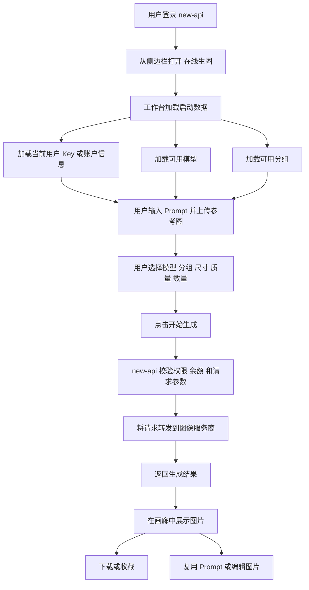
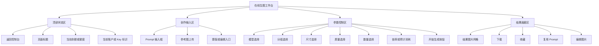

# 在线生图工作台

## 概要

本文档定义 `gpt-image-playground` 集成进 `new-api` 后的产品方向：把它改造成面向站内买量用户的官方在线生图工作台。

它不是通用 API Playground，也不是开发者调试工具。它应该是 `new-api` 后台中的一个低门槛生图入口，让已经在站内购买额度的用户，不需要理解 API Key、Base URL、Profile、服务商配置，就能直接生成图片。

## 产品定位

`在线生图工作台` 是 `new-api` 后台菜单中的一个功能入口，面向已登录且拥有站内额度的用户。

它的核心任务是：

> 用户输入 Prompt，按需上传参考图，选择自己有权限使用的模型和分组，然后用站内余额生成图片。

## 目标用户

主要用户：

- 已登录的 `new-api` 用户
- 在站内直接购买额度的用户
- 关注生成效果、消耗、稳定性，而不是 API 配置的用户

非主要用户：

- API 开发者
- 渠道管理员
- 服务商接入人员
- 需要节点式工作流的高级生图用户

## 产品目标

### 第一阶段目标

- 在 `new-api` 菜单中增加“在线生图”入口
- 将现有 `gpt-image-playground` 生图体验嵌入 `new-api` 产品表面
- 自动使用当前用户的有效 Key
- 默认请求当前站点的 `/v1`
- 隐藏 API 配置、Profile 管理、Base URL、手动 Key 输入
- 支持 Prompt 输入、参考图上传、生成、下载、复用

### 第二阶段目标

- 只展示当前用户可用的模型
- 只展示当前用户可用的分组
- 展示当前余额或额度
- 展示模型倍率、分组倍率，或轻量级预计消耗
- 优化面向用户的业务错误提示

### 第三阶段目标

- 将生成结果与 `new-api` 用量日志打通
- 支持跳转查看相关计费/日志记录
- 支持一键创建生图专用 Key
- 支持管理员配置功能开关和默认参数

## 产品形态

推荐形态：

- 保持 `gpt-image-playground` 独立构建
- 以同域路径挂载到 `new-api`
- 在 `new-api` 菜单中作为原生入口展示

推荐路径：

```text
/image-playground
```

推荐菜单：

```text
AI 能力 / 在线生图
```

不建议第一阶段使用 iframe。iframe 接入快，但登录态、文件上传、移动端滚动、返回行为和弹窗体验都更容易出问题。同域挂载静态产物更稳。

## 核心体验

### 用户流程

```text
登录 new-api
-> 从侧边栏打开“在线生图”
-> 页面加载当前用户启动数据
-> 用户输入 Prompt
-> 用户按需上传参考图
-> 用户选择模型、分组、尺寸、质量、数量
-> 用户点击生成
-> new-api 完成鉴权、转发和计费
-> 前端展示生成结果
-> 用户下载、收藏、复用或编辑
```

### 用户流程图



### 体验原则

- 用户不应该看到原始 API 配置
- 用户不应该需要粘贴 Key
- 用户不应该能选择自己无权使用的模型或分组
- 错误信息先讲业务含义，再提供技术细节
- 生成按钮附近应该展示额度或消耗信息

## 信息架构

### 普通用户可见控件

- 页面标题
- 返回控制台
- 当前余额 / 额度
- 当前使用账户或 Key 名称
- Prompt 输入
- 参考图上传
- 模型选择
- 分组选择
- 尺寸选择
- 质量选择
- 数量选择
- 生成按钮
- 结果画廊
- 下载 / 收藏 / 复用 / 编辑操作

### `new-api mode` 下隐藏控件

- Base URL 输入
- 手动 API Key 输入
- Profile 切换
- 服务商切换
- 自定义服务商导入/导出
- 代理配置
- 开发者高级选项

### 信息架构图



## UI 设计方向

面向人群：站内买量用户，处在后台/控制台类产品环境中。

界面气质应该是：

- 安静
- 聚焦
- 适合反复使用
- 明确属于 `new-api`
- 像工作台，而不是营销页

推荐表现：

- 保留现有以图片结果为核心的画廊体验
- 将配置收敛成稳定的参数区
- 让 Prompt 和生成按钮成为最高优先级
- 顶部持续展示余额和当前账户状态
- 不做装饰性 Hero 区域

## 预期 UI

### 桌面端线框图

```text
+--------------------------------------------------------------------------------------------------+
| Sidebar | 在线生图                                              余额: 1280 点   返回控制台      |
|         | 当前账户: 生图 Key A / default 组                                                  |
+--------------------------------------------------------------------------------------------------+
|                                                                                                  |
|  Prompt                                                                                          |
|  +--------------------------------------------------------------------------------------------+  |
|  | 描述你想生成的图片...                                                                      |  |
|  |                                                                                            |  |
|  +--------------------------------------------------------------------------------------------+  |
|                                                                                                  |
|  参考图上传区                                                                                     |
|  +------------------+  +------------------+  +------------------+  +----------------------+    |
|  | 上传参考图       |  | 已上传图片 1     |  | 已上传图片 2     |  | 蒙版/编辑入口        |    |
|  +------------------+  +------------------+  +------------------+  +----------------------+    |
|                                                                                                  |
|  参数区                                                                                            |
|  +----------------+ +----------------+ +--------------+ +--------------+ +------------------+   |
|  | 模型           | | 分组           | | 尺寸         | | 质量         | | 数量             |   |
|  | gpt-image-1    | | default        | | 1024x1024    | | high         | | 1                |   |
|  +----------------+ +----------------+ +--------------+ +--------------+ +------------------+   |
|                                                                                                  |
|  当前倍率: 模型 x1.0 · 分组 x1.0                            预计消耗: 约 40 点   [开始生成]      |
|                                                                                                  |
+--------------------------------------------------------------------------------------------------+
|  结果画廊                                                                                         |
|  +---------------------+ +---------------------+ +---------------------+ +--------------------+  |
|  | 结果图 1            | | 结果图 2            | | 结果图 3            | | 结果图 4           |  |
|  |                     | |                     | |                     | |                    |  |
|  | 下载 收藏 复用 编辑 | | 下载 收藏 复用 编辑 | | 下载 收藏 复用 编辑 | | 下载 收藏 复用 编辑|  |
|  +---------------------+ +---------------------+ +---------------------+ +--------------------+  |
+--------------------------------------------------------------------------------------------------+
```

### 移动端线框图

```text
+--------------------------------------+
| <- 返回   在线生图      余额 1280 点 |
| 当前账户: 生图 Key A                |
+--------------------------------------+
| Prompt                               |
| +----------------------------------+ |
| | 描述你想生成的图片...            | |
| +----------------------------------+ |
| 上传参考图  [ + ]                   |
|                                      |
| 模型        [ gpt-image-1        v ] |
| 分组        [ default            v ] |
| 尺寸        [ 1024x1024          v ] |
| 质量        [ high               v ] |
| 数量        [ 1                  v ] |
|                                      |
| 当前倍率: x1.0 / x1.0                |
| 预计消耗: 约 40 点                    |
| [            开始生成              ] |
+--------------------------------------+
| 结果                                 |
| +----------------------------------+ |
| | 图片 1                           | |
| +----------------------------------+ |
| 下载  收藏  复用  编辑               |
| +----------------------------------+ |
| | 图片 2                           | |
| +----------------------------------+ |
| 下载  收藏  复用  编辑               |
+--------------------------------------+
```

## 导航与菜单集成

### 菜单位置

推荐侧边栏位置：

```text
AI 能力
- 在线生图
```

它不应该放在设置页下。对买量用户来说，这是一个主要操作入口。

### 返回行为

返回目标保持固定：

```text
/dashboard/overview
```

标题区域和显式返回按钮都可以使用同一个返回目标。

## 前端集成策略

当前 `gpt-image-playground` 已经支持：

- `VITE_ENABLE_NEW_API`
- 通过 `/api/token/` 获取当前用户 Key 列表
- 通过 `/api/token/batch/keys` 获取真实 Key
- 同域携带凭证请求
- `New-Api-User` 请求头
- 运行时环境变量注入
- 固定返回地址

所以产品改造不是“从零接入 new-api”。

真正的产品改造是：

> 把它从通用 API 生图工具，收敛成站内买量用户使用的官方生图工作台。

### 推荐前端模式

使用专门的 `new-api mode`，默认配置如下：

```env
VITE_ENABLE_NEW_API=true
VITE_SHOW_DEFAULT_CONFIG_ONLY=true
VITE_DEFAULT_API_URL=/v1?apiMode=images
VITE_RETURN_BASE_URL=/dashboard/overview
```

### 前端改造项

1. 在 `new-api mode` 下隐藏原始 API 配置
2. 将 Key 选择重命名为账户/额度选择，而不是开发者 Key 管理
3. 增加模型、分组、额度、默认值的启动数据加载
4. 生成前做产品级校验
5. 清晰展示 `new-api` 返回的业务错误

## 后端集成策略

### 可复用现有接口

以下接口已经可用于第一阶段：

- `GET /api/token/`
- `POST /api/token/batch/keys`
- `GET /api/user/models`
- `GET /api/user/self/groups`
- `GET /api/user/self`
- `POST /v1/images/generations`
- `POST /v1/images/edits`

### 推荐新增聚合接口

为了减少前端拼装逻辑，建议新增：

```http
GET /api/image-playground/bootstrap
```

建议响应：

```json
{
  "user": {
    "id": 1,
    "quota": 10000,
    "used_quota": 1200
  },
  "groups": [
    {
      "name": "default",
      "desc": "默认分组",
      "ratio": 1
    }
  ],
  "models": [
    {
      "id": "gpt-image-1",
      "name": "gpt-image-1",
      "type": "image",
      "ratio": 1
    }
  ],
  "tokens": [
    {
      "id": 12,
      "name": "生图 Key",
      "group": "default",
      "model_limits": "gpt-image-1",
      "masked_key": "sk-xxx...abcd"
    }
  ],
  "defaults": {
    "group": "default",
    "model": "gpt-image-1",
    "apiMode": "images"
  }
}
```

## 权限与信任边界

前端不能作为权限源。

后端仍然负责最终判断：

- 当前用户是否能访问指定 token
- 当前用户是否能使用指定分组
- 当前用户是否能使用指定模型
- 实际计费和额度扣减
- 最终错误语义

前端只负责降低使用门槛和提升可理解性。

## 计费与消耗展示

### 第一阶段

展示：

- 当前余额 / 额度
- 选中模型倍率
- 选中分组倍率

### 第二阶段

展示：

- 提交前预计消耗
- 完成后实际消耗
- 清晰的余额不足提示

不要在前端复制完整后端计费引擎。第一版可以只做提示型预估。

## 错误处理

错误文案优先面向普通买量用户。

示例：

- `余额不足，无法生成图片，请充值后重试`
- `当前账户没有可用生图 Key，请先创建 Key 或联系管理员`
- `你当前无权使用该模型，已切换到默认可用模型`
- `图片生成失败，服务商返回错误：{message}`

可以提供可展开的技术详情，方便客服和排查。

## 上线规划

### 第一阶段：入口与引导模式

- 增加菜单入口
- 同域挂载前端
- 启用 `new-api mode`
- 隐藏原始配置
- 自动选择当前有效 Key
- 保持固定返回目标

### 第二阶段：权限感知控件

- 加载用户可用模型
- 加载用户可用分组
- 筛选生图模型
- 展示余额
- 优化校验和错误文案

### 第三阶段：消耗与可观测性

- 展示倍率和预计消耗
- 展示实际扣费结果
- 关联生成请求到日志
- 增加管理员默认值和功能开关

### 第四阶段：创作增强

- Prompt 模板
- 风格预设
- 批量生成
- 作品合集
- 轻量团队共享

## 非目标范围

第一版不做：

- 完整 UI 重写
- 节点式工作流编辑器
- 自定义服务商构建器
- 独立计费系统
- 完整任务队列重构
- 多租户素材管理平台

## 成功标准

第一阶段成功标准：

- 用户能从 `new-api` 侧边栏打开在线生图
- 用户不需要粘贴 Key
- 用户不需要编辑 Base URL
- 用户能用已有站内余额生成图片
- 失败时用户知道失败原因
- 结果可以下载和复用

第二阶段成功标准：

- 用户只看到自己实际可用的模型和分组
- 余额不足状态清晰
- 管理员可以控制功能开放
- 客服或运营能追踪图片生成用量

## 最终建议

近期正确方向是：

> 继续复用 `gpt-image-playground`，但把它收敛成 `new-api` 官方站内生图工作台。

不要从零重做。先去掉使用门槛，补齐权限感知、额度展示、消耗提示和业务错误体验，让 `new-api` 继续作为计费和转发的唯一事实源。
