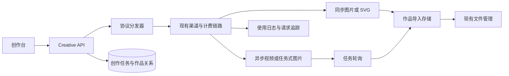
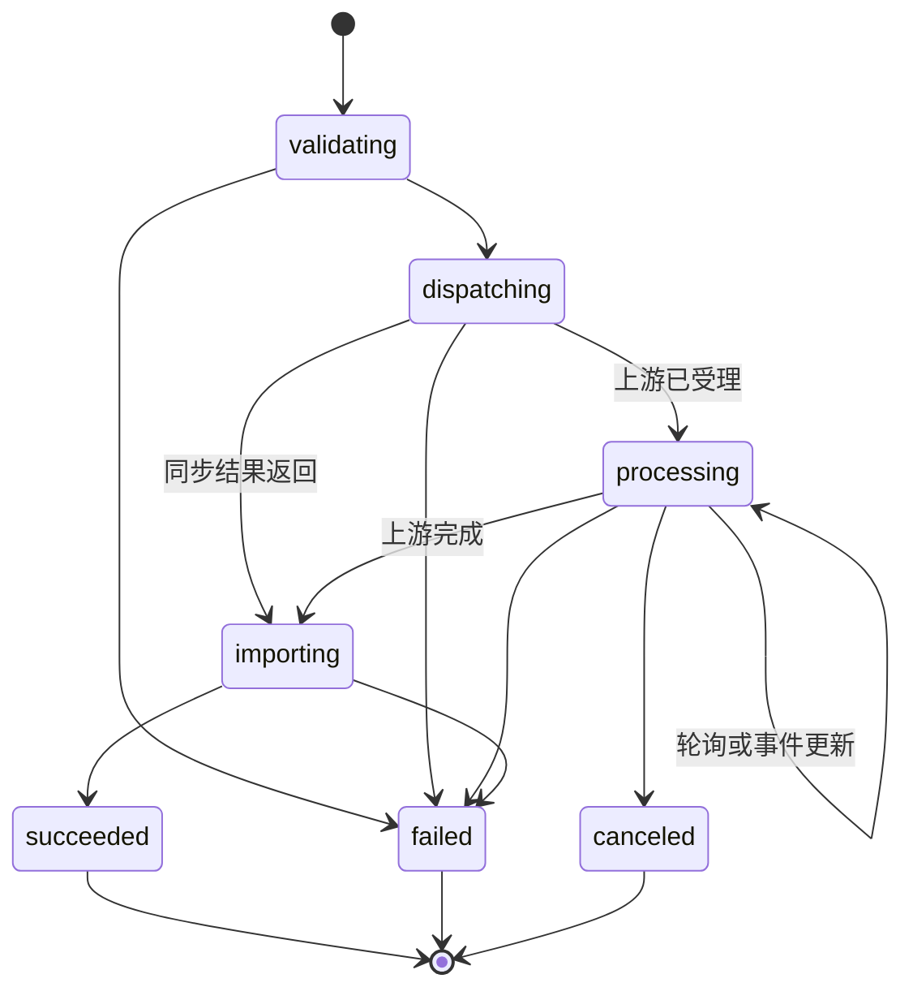

# 创作台（Creative Studio）设计初稿

## 1. 状态与已确认决策

**状态：设计初稿，尚未开始实现。**

本设计以站内已登录用户为对象，替换现有侧边栏「在线生图」入口的产品逻辑。入口文案改为「创作台」，保留 `/imgen` 作为兼容地址；新的默认前端页面承载创作台，而不是继续跳转到独立的生图应用。

已确认：

1. 作品必须长期保存、可回看；图片、视频和 SVG 均进入现有文件管理体系，管理员可为创作台配置默认的作品保存渠道。
2. 同一模型允许按用户分组分别发布，并可具有不同的可见性、排序和默认参数；计费仍以现有模型倍率和分组倍率为准。
3. 首期覆盖现有全部图片、视频协议；同时支持 Claude Messages 输出 SVG 矢量图。
4. 用户只能看见管理员发布、其当前可用分组中存在可用兼容渠道的模型。
5. 创作台不承载聊天模型；聊天继续由「游乐场」处理。

## 2. 目标与边界

### 2.1 目标

- 以「图片」「视频」作为一级创作类型；SVG 矢量图是图片生成的一种输出类型，而不是独立工作区。
- 统一同步、流式和异步上游协议，向前端提供一个长期存在的创作任务和作品库。
- 复用现有用户、分组、渠道、额度、计费、使用日志、文件上传渠道和主题能力。
- 管理端集中于「运维 → 创作台管理」，完成模型能力、分组发布、渠道绑定、默认参数和作品保存渠道的配置。
- 采用 `web/default` 的现有布局、颜色变量、`Tabs`、表单和数据表格，不引入独立视觉系统；亮色、暗色、跟随系统主题均自然适配。

### 2.2 非目标

- 不把创作台做成 ComfyUI 式节点工作流或通用聊天页面。
- 不让浏览器直接持有上游 API Key，或通过用户 API Key 调用创作功能。
- 不复制现有的模型计费、渠道权重、重试和文件渠道配置。
- 不把上游临时 URL 当作作品的长期地址。
- 不在第一期支持团队协作、公开作品广场或跨用户作品共享。

## 3. 当前基础与关键缺口

项目已经具备图片路由、视频任务路由、Claude Messages 路由、文件上传渠道和异步日志，但这些能力尚未形成一个面向用户的统一创作任务域。



`abilities` 是渠道路由索引，主键为 `group + model + channel_id`，会随渠道模型和分组自动更新。它不表达图片、视频或 SVG 输出能力，不能替代创作台模型目录。

现有 `image_playground.model_registry` 仅描述图片模型的展示和适配器类型，且作为全局 Option 存储。它应被迁移到下面的创作台模型目录，不能继续作为视频、SVG 输出或渠道兼容性的唯一来源。

现有 Inflight 日志只将图片归为 `image`，视频尚未作为独立类型，且数据保存在短期 Redis 记录中。因此它可提供状态标签和重试详情的交互参考，但不能承担作品历史。

## 4. 信息架构与交互

### 4.1 路由与菜单

| 项目 | 方案 |
| --- | --- |
| 用户入口 | 现有侧边栏位置不变，`Online Image Generation` 重命名为 `Creative Studio` / `创作台`。 |
| 主地址 | `/imgen` 保持为创作台地址，避免旧书签和外部跳转失效。 |
| 新页面 | 在 `web/default` 的认证路由下实现；移除该菜单项的 `native` 外跳语义。 |
| 管理入口 | 系统设置的「运维」分组下新增「创作台管理」。 |
| 旧图片注册表 | 管理端首次打开时引导迁移；迁移完成后不再提供独立「图片模型配置」入口。 |

### 4.2 用户工作区

创作台使用与异步日志相同的紧凑型 `Tabs` 标签样式作为一级类型切换，而不是为每类能力建立不同菜单：

```text
创作台
┌──────────────────────────────────────────────────────────┐
│ [图片] [视频]                                我的作品     │
├───────────────────────────────┬──────────────────────────┤
│ 创作面板                      │ 作品与任务               │
│ - 模型、供应商、分组           │ - 进行中任务             │
│ - Prompt                      │ - 最新作品瀑布流         │
│ - 当前类型的通用参数           │ - 失败原因与重试         │
│ - 参考素材                     │ - 打开、下载、复用       │
│ - 高级参数（模型声明后显示）   │                          │
│                  [开始创作]   │                          │
└───────────────────────────────┴──────────────────────────┘
```

- **图片**：文生图、图生图、编辑和 SVG 矢量图均属于图片生成。模型能力决定可选操作和输出类型；显示 Prompt、参考图、比例、尺寸、数量、质量等字段。选择 Claude SVG 模型时仅呈现其声明的画布尺寸、配色等图片参数，并将结果以 SVG 图片作品展示。
- **视频**：显示 Prompt、首帧/参考图、比例、时长、分辨率等字段；提交后立即出现任务卡片，持续展示排队、处理中、导入中、成功或失败状态。
- **我的作品**：只显示当前用户拥有的任务和文件；支持按类型、模型、状态和时间筛选。它是持久化的作品历史，不复用短期 Inflight 日志列表。

模型选择器只显示当前类型下、当前用户分组可用、已发布且存在兼容渠道绑定的模型。图片类型内还会标记输出为「位图」或「SVG 矢量」；模型切换时，前端从服务端返回的声明式参数模式重新渲染表单。用户切换图片/视频时保留各自草稿，但不把图片字段带到视频请求。

### 4.3 主题与可访问性

- 使用现有 `ThemeProvider`、CSS 语义变量和 `dark:` 规则；不写固定浅色背景、固定灰色边框或独立调色板。
- 复用现有 `Tabs`、`Form`、`ComboboxInput`、`StatusBadge`、`DataTable`、`Dialog` 与 `toast` 组件。
- 图片和视频卡片使用 `aspect-ratio` 容器、懒加载缩略图和清晰的加载替代状态；SVG 使用服务端净化后的文件 URL，不直接注入未经处理的标记。
- 所有文案使用 i18n；键盘可切换标签、操作任务卡片和打开作品详情。

## 5. 统一创作任务模型

无论上游是同步响应、SSE 还是异步轮询，用户侧都只处理一种资源：`CreativeTask`。

### 5.1 状态机



| 执行类型 | 示例 | 服务端行为 |
| --- | --- | --- |
| `sync` | OpenAI 图片生成、同步图片编辑 | 先创建任务，调用现有 Relay；得到结果后导入作品文件，再将任务标为成功。 |
| `async` | `/v1/videos`、`/v1/video/generations`、Kling、Midjourney 等任务式协议 | 保存上游任务 ID；后台轮询或接收回调，完成后导入作品文件。 |
| `stream` | 未来流式创作协议 | 记录流事件和阶段，最终统一进入作品导入。首期不把 SSE 直接暴露为作品完成依据。 |
| `sync_artifact` | Claude Messages 生成 SVG | 用非流式 Claude 请求获得完整文本，提取和净化 SVG，写入文件管理后完成任务。它仍属于图片任务。 |

任务状态为 `validating`、`dispatching`、`processing`、`importing`、`succeeded`、`failed`、`canceled`。对用户仅显示易理解标签；渠道尝试链、错误详情和重试次数沿用 Inflight 日志的详情模型，但仅当实际发生重试时显示尝试详情。

### 5.2 与现有计费和日志的关系

- 创作请求必须进入既有 Relay、预扣费、结算和使用日志流程；创作台不自行计算或写入配额。
- `creative_task.request_id` 关联现有请求 ID，`channel_id`、实际模型、用量日志 ID 和最终消费额只作为审计快照保存。
- 当上游失败或重试时，沿用现有渠道选择、权重和重试规则；创作任务只汇总对用户有意义的最终状态。
- 取消只在模型/协议声明支持取消时显示；不能取消的任务不伪造「已取消」。

## 6. 协议适配层

创作 API 不是将用户请求直接转发到固定路径。它先解析模型能力，再由适配器生成该协议所需的 Relay 请求、异步查询与结果提取方式。

| 类别 | 首期适配范围 | 标准化输出 |
| --- | --- | --- |
| 图片 | OpenAI Images 生成/编辑、OpenAI Responses 图片、Gemini Imagen、FAL、Replicate、Stability、Ideogram、FLUX、Midjourney、已配置 Custom 协议，以及 `claude_svg` | 一至多个位图或 SVG 图片结果、可选进度、原始参数快照。 |
| 视频 | OpenAI 兼容 `/v1/videos`、`/v1/video/generations`、视频 remix、Kling 文生/图生视频及当前已接入的任务渠道 | 上游任务 ID、进度、视频文件、缩略图和时长。 |

每个适配器实现以下稳定语义：

1. 校验并规范化前端参数；所有数量、时长和分辨率倍率在进入计费前复用现有边界常量。
2. 构建对应上游协议请求和请求路径，复用现有渠道适配器而不是复制供应商 HTTP 客户端。
3. 将同步结果、异步任务 ID 或流结束事件标准化为 `CreativeTask` 更新。
4. 提取最终媒体 URL 或字节流，交给作品导入服务。
5. 提供可选的取消和状态查询能力；不支持时显式声明。

### 6.1 Claude SVG 安全契约

`claude_svg` 不表示存在独立的「Claude 矢量图 API」。它是一个受控的 Claude Messages 请求：系统指令要求只返回完整 SVG，服务端从返回文本或代码块中提取 `<svg>` 根节点。

- 只接受一个大小受限、结构完整的 SVG 文档；没有 SVG 或包含多个根图时任务失败并保留可诊断错误。
- 移除 `script`、事件处理器、`foreignObject`、远程资源引用、危险 URL 和未经允许的动画；必要时用白名单 SVG 元素和属性重序列化。
- SVG 以 `image/svg+xml` 导入文件管理，前端通过文件 URL 下载或预览，禁止 `dangerouslySetInnerHTML` 渲染原文本。
- 计费按 Claude 实际 Relay 用量；成品保存成功才将创作任务标记为成功。

## 7. 数据设计

### 7.1 对 `model_ability.sql` 草案的审核

不采用草案中的 `model_ability` 表作为最终结构，原因如下：

| 草案问题 | 风险 | 替代方案 |
| --- | --- | --- |
| `model_id` | 当前没有可引用的全局模型表，路由按模型名工作。 | 使用 `creative_model.model_name`，并建立稳定的内部 ID。 |
| `abilities` 逗号字符串 | 无枚举约束、无法建立唯一性/索引、不能表达一个模型同时拥有不同协议和执行方式。 | 每种大类能力一条 `creative_model_capability` 记录。 |
| `desc` | 名称含义模糊且容易与 SQL `DESC` 混淆。 | 改为 `description`。 |
| MySQL DDL | `AUTO_INCREMENT`、`ON UPDATE` 和脚本中的 `DROP TABLE` 不适合 SQLite/PostgreSQL 迁移。 | 定义 GORM Model，由 `AutoMigrate` 和项目现有跨库迁移模式创建。 |
| 没有渠道绑定 | 同名模型可能被路由到只支持聊天或其他协议的渠道。 | 发布记录必须绑定兼容渠道和请求协议。 |
| 没有作品任务 | 不能保存长期历史、上游任务 ID、文件引用或计费关联。 | 新增任务和任务资产表。 |

### 7.2 推荐实体

| 表 | 作用 | 核心唯一性与字段 |
| --- | --- | --- |
| `creative_model` | 全局模型目录。 | `model_name` 唯一；`display_name`、`vendor`、`description`、`status`、`sort_order`、审计字段。 |
| `creative_model_capability` | 一个模型的一种创作能力。 | `model_id + category + operation` 唯一；`category=image/video`、`operation=generate/edit/remix`、`asset_kind=raster/vector`、`protocol`、`execution_mode`、`input_schema`、`default_params`、`enabled`。 |
| `creative_model_publication` | 将模型能力发布给一个用户分组。 | `capability_id + group` 唯一；`enabled`、`sort_order`、`group_default_params`。倍率仍来自既有模型/分组定价。 |
| `creative_channel_binding` | 声明某发布项可使用的具体渠道和协议路径。 | `publication_id + channel_id + request_path` 唯一；`enabled`、`request_model`、`priority`、`weight`、异步查询/取消配置。 |
| `creative_task` | 用户发起的一次持久化创作。 | 用户、类别、模型、分组、状态、请求 ID、上游任务 ID、参数快照、错误、时间、账务快照。 |
| `creative_task_asset` | 输入和输出素材与任务的关系。 | `task_id + user_file_id + role + position` 唯一；`role=input/output/thumbnail`、媒体元数据。 |

JSON 配置列以 `TEXT` 保存并通过 `common.Marshal` / `common.Unmarshal` 处理，确保 SQLite、MySQL 和 PostgreSQL 都能迁移。模型、渠道和用户之间不使用会阻塞历史审计的物理外键；由服务层校验引用存在性和删除限制。

### 7.3 渠道兼容性与路由

`creative_channel_binding` 是本设计的关键：它不能只靠 `model_name` 查 `abilities`。创作分发器需要在当前用户分组内选择已发布、已启用且具有匹配绑定的渠道，再复用渠道优先级、权重、健康状态和重试规则。

创建或编辑绑定时必须验证：

1. 渠道已启用，且该渠道的 `abilities` 中包含对应分组和模型。
2. 协议请求路径与模型能力的 `protocol` 匹配。
3. 对 Advanced Custom 渠道，已配置匹配的 `advanced_routes`；对其他渠道，由适配器确认其 Relay Mode 支持该路径。
4. 当前文件保存渠道可用；保存渠道失效时，管理员不能发布需要作品导入的能力。

这避免了「目录说某模型会生图，但随机选中的同名渠道只支持聊天」的问题。

## 8. 作品持久化

作品不保存上游临时 URL，而是使用现有 `file_upload_channel`、`file` 和 `user_file` 表。创作台在任务成功后创建 `user_file.source = creative_studio` 的用户逻辑文件，再将它关联到 `creative_task_asset`。

### 8.1 导入流程

```text
上游返回媒体 URL / SVG 文本
→ 校验任务所属用户与协议
→ 受限下载或生成字节流
→ Storage Import 服务选择创作台默认 file_channel_id
→ Provider 流式写入对象存储
→ 写入 file + user_file
→ 写入 creative_task_asset
→ 任务成功
```

需要在既有 Storage Facade 中补充仅供服务端调用的 `ImportGeneratedAsset` 能力，以及 Provider 的受控 `UploadReader` 接口。该入口必须限制 MIME、文件大小、下载时长、重定向次数和目标地址，并使用现有 SSRF 防护；不能让任意用户提交 URL 让服务端下载。

视频文件可能很大，因此导入使用流式传输和临时大小上限，不将全文件读入内存。导入失败时创作任务为失败或「作品保存失败」的可重试终态，绝不把无持久化成品标为成功。

### 8.2 存储配置

在「运维 → 创作台管理」中只保存 `default_file_channel_id` 和允许的 MIME/大小策略；具体密钥、WebDAV/S3/ImgBed 配置继续由现有「文件上传渠道」管理，不复制配置或泄露密钥。

默认保存渠道被删除或停用前，必须阻止操作或要求先切换创作台默认渠道。

## 9. API 草案

### 9.1 用户 API

| 方法 | 路径 | 说明 |
| --- | --- | --- |
| `GET` | `/api/creative/bootstrap` | 返回当前用户可见的类别、模型、分组、参数模式、默认值、余额摘要和作品保存能力。 |
| `POST` | `/api/creative/tasks` | 校验参数，创建并提交创作任务；同步协议可返回已完成任务，异步协议返回处理中任务。 |
| `GET` | `/api/creative/tasks` | 分页获取当前用户任务/作品，支持类别、模型、状态、时间筛选。 |
| `GET` | `/api/creative/tasks/:id` | 获取单个任务、状态、资产和可展示错误。 |
| `POST` | `/api/creative/tasks/:id/cancel` | 仅对声明支持取消的非终态任务生效。 |
| `POST` | `/api/creative/tasks/:id/retry` | 重新发起一次创作，创建新任务，不覆盖原任务或原计费记录。 |

用户 API 统一使用 `UserAuth`；前端不再先取 API Key。服务端根据当前用户、选择的可用分组和模型发布记录完成分发。

### 9.2 管理 API

管理 API 位于 `/api/creative/admin/*`。读取可由具有运维权限的管理员使用；编辑模型发布、渠道绑定和默认保存渠道必须采用与渠道/文件上传渠道同等级的高权限校验，且不在普通管理员响应中返回渠道密钥。

管理页面包含：

1. **模型目录**：模型名称、厂商、描述、排序、状态。
2. **能力与参数**：图片/视频类别、图片操作和输出类型（位图/SVG 矢量）、协议、同步方式、可见字段、默认参数和参数校验规则。
3. **分组发布**：目标分组、是否启用、排序、分组默认参数。
4. **渠道绑定**：兼容渠道、路径、上游模型映射、权重、异步查询/取消策略与连通性校验。
5. **作品存储**：默认文件上传渠道、允许类型、图片/视频大小上限和保留策略。
6. **任务运维**：任务统计、失败原因聚合、孤儿导入重试和清理策略。

## 10. 前端实现边界

建议新增 `web/default/src/features/creative-studio/`，内部包含：

```text
creative-studio/
  api.ts                 # Creative API
  types.ts               # bootstrap、任务、资产、参数模式
  constants.ts           # 类别与状态的 i18n key
  lib/                   # 参数模式、草稿、任务状态转换
  hooks/                 # bootstrap、任务轮询、草稿持久化
  components/            # 类型标签、编辑器、参数面板、任务卡、作品卡
  index.tsx              # 工作区组合
```

类别表单由服务端 `input_schema` 描述，前端只实现白名单控件（文本、多行文本、数字、布尔、选择、滑块、文件、比例），不执行管理员下发的脚本或任意 JSX。服务端使用同一模式再次校验并进行请求转换。

任务列表使用 React Query 轮询：创建后短间隔刷新，处理中逐步退避，终态停止；页面重新打开从持久化任务读取。大量作品使用分页/虚拟列表和缩略图懒加载，避免首次加载全部历史文件。

## 11. 迁移与分阶段交付

### 阶段 A：基础域与迁移

- 创建创作台数据模型、GORM 迁移和管理 API。
- 将 `image_playground.model_registry` 迁移为 `creative_model + image capability + publication` 初始数据；模型名做 trim 和大小写去重。
- 保留旧 Option 只读回退一个版本；迁移完成后提示管理员检查渠道绑定。
- 新增 `/imgen` 认证页面和菜单重命名，不删除旧链接。

### 阶段 B：图片与 SVG

- 实现 OpenAI Images/Responses、Gemini Imagen、FAL、Replicate、Stability、Ideogram、FLUX、Midjourney 等已配置图片协议的适配器和绑定校验。
- 实现 `claude_svg` 提取、净化和 SVG 文件导入。
- 实现图片作品库（包含位图与 SVG）、下载、复用和失败重试。

### 阶段 C：视频与异步可靠性

- 实现 OpenAI 兼容视频、remix、Kling 及现有视频任务渠道的提交、轮询、取消和媒体导入。
- 完成任务恢复：服务重启后扫描未终态任务，按协议安全恢复轮询。
- 将任务详情与使用日志、Inflight 重试链建立可点击关联。

### 阶段 D：运营完善

- 增加作品保留策略、按渠道存储统计、失败率告警、模型健康状态和可观测性面板。
- 为未来音频、3D 或其他创作类别新增 `category` 和协议适配器，无需重构用户工作区。

## 12. 验收标准

1. 用户看到的「创作台」与现有默认前端主题一致，切换亮/暗/系统主题后无固定颜色或可读性问题。
2. 用户无法看到未发布、无可用渠道、超出模型限制或不属于其分组的模型。
3. 图片（位图与 SVG）、视频均创建持久化任务；刷新页面或服务重启后仍可查询最终状态和作品。
4. 异步视频不会因前端关闭而丢失；上游完成后作品被导入指定文件上传渠道。
5. SVG 不含可执行脚本、事件属性或外部资源引用，且只通过安全文件 URL 预览。
6. 所有创作请求经过既有额度、预扣费、结算和使用日志链路；失败、重试和取消不产生错误的重复扣费。
7. 管理端不能把能力发布到不兼容的渠道；保存渠道不可用时阻止发布和任务提交。
8. 旧 `/imgen` 链接可访问新创作台；原「在线生图」菜单文案不再对用户显示。

## 13. 实施前的技术检查

开始编码前应完成以下检查：

- 枚举所有当前图片、视频、Midjourney、Kling 与 Claude 渠道的真实 Relay Mode、请求路径、轮询/取消能力和结果格式，形成适配器契约测试表。
- 确认各视频上游结果 URL 的有效期、文件大小和下载鉴权方式，验证服务端导入可行性。
- 设计并测试 SVG 净化白名单、最大字节数和预览策略。
- 为新的任务表、作品导入、渠道绑定选择和分组可见性添加 SQLite、MySQL、PostgreSQL 回归测试。
- 在实现前确认当前部署中 `/imgen` 的旧静态资源挂载方式，确保切换为默认前端路由时不破坏历史访问。
