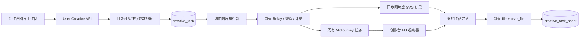
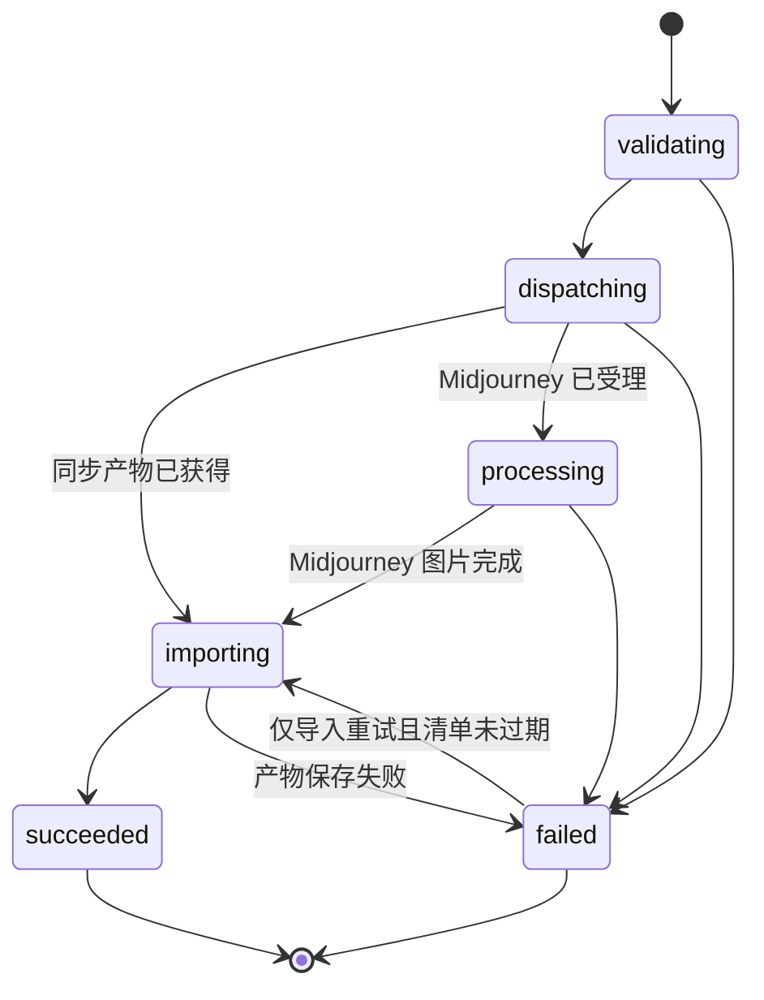

# 创作台阶段二详细设计（图片与 SVG）

> 状态：待实施。本文以 `Stage-One-Final-20260713.md` 为配置域基线；如与初稿或阶段一的其他文件冲突，以本文为准。

## 1. 交付范围

阶段二交付已登录用户可用的“图片”创作工作区，以及长期保存的图片、SVG 作品库。它覆盖管理员在阶段一目录中发布的全部**现有图片能力**：OpenAI Images、OpenAI Responses 图片工具、Gemini Imagen、FAL、Replicate、Stability、Ideogram、FLUX、Midjourney、已配置的 Advanced Custom/OpenAI 兼容图片渠道和 `claude_svg`。

这里的“覆盖”指所有实际供应商继续由既有渠道适配器处理；创作台不为每家供应商重写 HTTP 客户端、模型映射、预扣费、结算、使用日志、渠道健康检查或重试逻辑。

本阶段不交付：

- 视频工作区、视频任务、视频轮询、视频导入、视频 remix 或取消。它们属于阶段三。
- 聊天模型、游乐场、用户 API Key、浏览器直连上游或对任意 URL 的服务端下载。
- 新的通用工作流、通用任务引擎、公开作品广场、跨用户共享和团队协作。
- 旧 `image_playground.model_registry`、旧 `/api/image-playground/bootstrap` 的迁移、读取、回写或兼容逻辑。

## 2. 已确认的实现决策

| 决策 | 方案 | 原因 |
| --- | --- | --- |
| 用户入口 | `/imgen` 改为默认前端认证页，侧边栏保留地址但移除 `native=true`。 | 旧书签可访问，创作台不再外跳旧生图应用。 |
| 用户身份 | 全部用户 API 使用 `UserAuth`；服务端从当前登录用户解析可用分组。 | 不暴露或要求用户 API Key。 |
| 历史资源 | 新建 `creative_task`、`creative_task_asset`；一张图片创作请求对应一条持久任务。 | 既有 Inflight 日志是短期诊断数据，不能承载作品历史。 |
| 同步图片 | 创建任务后在同一请求内调用现有 Relay、导入全部产物，再返回任务。 | 复用现有图片 Relay 的渠道、倍率、计费和重试。 |
| Midjourney 图片 | `creative_task` 保存既有 Midjourney 任务 ID；既有 Midjourney 轮询器仍是上游状态事实来源。 | 不合并、迁移或双写既有 `midjourney` 表。 |
| 失败重试 | 上游失败时 `POST /retry` 创建一条新任务；存储失败且临时结果仍有效时仅重试导入。 | 不覆盖审计、计费或原作品。 |
| 取消 | 阶段二不提供取消路由。 | 当前同步图片、Claude 和 Midjourney 代码没有可复用的取消契约。 |

## 3. 架构与职责



分层保持 `Router → Controller → Service → Model`：

1. `controller/creative_studio.go` 仅绑定用户请求、获取当前用户 ID、返回统一 API 响应。
2. `service/creative_studio_*.go` 负责目录可见性、任务状态转换、参数合并、资产归属、作品查询和导入编排。
3. `relay/` 新增面向创作台的**最小导出执行入口**。它接收已校验的能力、候选绑定和规范化请求，复用既有图像/Responses/Claude/Midjourney Relay 代码。不得在服务层通过 HTTP 回调本机 `/v1/*`，不得伪造用户 Token。
4. `service/storage` 新增仅服务端使用的产物导入和受控读取能力；浏览器 `Prepare/Complete` 上传流程保持不变。

创作执行器可从既有 Relay 提取共用的“选渠道、预扣、发送、重试、结算、使用日志”编排；它不得复制该编排。创作台只把候选渠道限制为已验证、已启用的渠道绑定，并按 `priority DESC, id ASC` 提供给共用选路逻辑。渠道的全局优先级、权重、健康状态、多 Key 策略和重试规则仍然生效。

## 4. 配置域升级与协议契约

### 4.1 渠道绑定的阶段二语义

阶段一创建的绑定均为 `enabled=false`，`validation_status=pending|invalid`。阶段二新增“重新验证并启用”的管理操作；只有以下条件全部成立时才可以写入 `enabled=true`、`validation_status=valid`：

1. 模型、能力、发布和绑定均已启用，且发布分组仍有效。
2. 渠道已启用，`abilities` 仍包含该发布分组与目录模型。
3. 能力 `protocol` 已在服务端协议目录注册，且其 `category=image`、`operation`、`asset_kind`、`execution_mode` 与协议契约一致。
4. 协议确认该渠道类型、Relay Mode 和请求路径可处理该能力；Advanced Custom 还必须存在相符的 `advanced_routes`。
5. 创作台默认保存渠道已启用、非 local，且能导入该能力可能产生的 MIME 类型。

验证接口只返回安全的状态与消息，绝不返回渠道 Key、`config_profile`、上游正文、带签名的 URL 或请求头。

目录模型改名时，服务在同一数据库事务内更新下属绑定的 `request_model` 快照，重置其 `enabled=false`、`validation_status=pending` 并清空旧验证信息。管理员必须重新验证后才能发布，避免旧模型名被静默发送到上游。

### 4.2 受支持协议目录

`creative_model_capability.protocol` 不是管理员可执行的 URL 或脚本，而是服务端固定枚举。固定目录及请求契约如下；所有“内部入口”都必须抽取/复用现有 Relay 实现，不能由创作台自行持有渠道密钥发 HTTP 请求。

| protocol | 能力约束 | 内部入口与上游适配 | 执行方式 | 规范化结果 |
| --- | --- | --- | --- |
| `openai_image` | `image` + `generate|edit` + `raster` | `POST /v1/images/generations` 或 `/v1/images/edits` 的既有 `RelayFormatOpenAIImage`；其已有渠道适配器覆盖 OpenAI、Gemini Imagen、FAL、Replicate、Stability、Ideogram、FLUX 及兼容渠道。 | `sync` | 一至多个 `url` 或 `b64_json` 位图。 |
| `openai_responses_image` | `image` + `generate` + `raster` | 既有 `POST /v1/responses` 与图片生成工具结果解析。 | `sync` | 一至多个图片生成调用产物；无图片产物即失败。 |
| `advanced_custom_image` | `image` + `generate|edit` + `raster` | 既有 Advanced Custom 的 OpenAI 图片转换；仅允许已配置图片路由。 | `sync` | OpenAI 图片响应语义。 |
| `midjourney_image` | `image` + `generate|edit` + `raster` | 既有 `/mj/submit/*`、`midjourney` 表和轮询器；只允许图片动作。 | `async` | 既有任务 ID，终态的 `imageUrl`。 |
| `claude_svg` | `image` + `generate` + `vector` | 既有非流式 `POST /v1/messages`；服务端限定系统指令并提取文本结果。 | `sync_artifact` | 一个净化后的 SVG 文档。 |

`openai_image` 是创作台复用既有图片 Relay 的统一入口，不按供应商复制 `fal_image`、`flux_image` 等协议。若某个渠道适配器只返回异步句柄、SSE 且没有可聚合终态，或结果不能解析为上述规范化结果，验证必须拒绝启用该绑定，并在阶段三/后续为它补充明确的协议契约和测试后再开放。

创作请求一律强制非流式；用户参数和 `input_schema` 不得下发 `stream=true`。上游意外返回 SSE 时，协议实现必须在字节、事件数和总时长上限内聚合终态；没有可验证终态即失败，不把半成品写为作品。

### 4.3 Claude SVG 安全契约

`claude_svg` 不是独立 Claude 图片 API。它构造一个非流式 Claude Messages 请求，固定系统指令要求仅输出一个完整 SVG；用户 Prompt 只能作为用户消息，不能覆盖系统指令或注入工具定义。

1. 从普通文本或单个 Markdown 代码块提取唯一 `<svg ...>...</svg>` 文档；没有、多个或截断根节点均失败。
2. 限制 UTF-8 SVG 原始字节数；XML 解析失败、DOCTYPE、实体声明、`script`、`foreignObject`、事件属性、外部 URL、`data:` URL、危险滤镜/动画属性一律拒绝或移除。
3. 以 SVG 元素和属性白名单重序列化，不保留原始标记；禁止 `dangerouslySetInnerHTML`。
4. 将净化字节以 `image/svg+xml` 导入作品存储，导入成功才可置任务为 `succeeded`。
5. Claude 的实际 Relay 用量照既有链路计费；SVG 净化或保存失败不伪造成功结果。

SVG 白名单、最大字节数和恶意样本必须是可直接测试的服务端常量/测试数据，而不是管理员可编辑的任意正则或脚本。

## 5. 任务与资产数据

两张新表均通过 GORM 注册到 `migrateDB` 与 `migrateDBFast`，支持 SQLite、MySQL 5.7.8+、PostgreSQL 9.6+。JSON 统一为 `TEXT`，由 `common.Marshal` / `common.Unmarshal` 读写；不建立物理外键，不使用数据库专属 JSON、UPSERT、AUTO_INCREMENT 或 SERIAL。

### 5.1 `creative_task`

| 字段 | 规则 |
| --- | --- |
| `id`、`task_key` | 内部 ID；`task_key` 为不可猜测、全局唯一的公开 ID（例如 `ct_` 前缀随机值）。用户 API 只接受 `task_key`。 |
| `user_id` | 任务所有者；所有用户查询首先按它过滤。 |
| `category` | 本阶段恒为 `image`，保留列供阶段三扩展。 |
| `capability_id`、`binding_id` | 创建时选择的配置 ID，仅供审计；历史读取不依赖它们仍然存在。 |
| `model_name`、`display_name`、`group_name`、`protocol`、`execution_mode` | 创建时快照，避免管理员后续改配置改变历史。 |
| `channel_id`、`request_id`、`external_task_id` | 实际渠道、既有 Relay 请求 ID、Midjourney 任务 ID；无值时为空。 |
| `status` | 见第 6 节枚举。 |
| `requested_params`、`resolved_params` | 请求及“能力默认 → 分组默认 → 用户允许字段”合并后的 JSON 对象；不写入密钥、临时 URL 或原始文件字节。 |
| `result_manifest`、`import_expires_at` | 仅在产物已获得但导入重试需要时保存的私有临时清单；用户/API 响应永不返回；成功或过期后清空。 |
| `error_code`、`error_message` | 稳定错误码与已脱敏的用户可读信息，不保存上游正文或授权 URL。 |
| `retry_of_id` | 重试创建的新任务指向原任务；原任务不可覆盖。 |
| `started_at`、`finished_at`、审计时间 | 用于排序、状态恢复和运维。 |

索引至少包含：`task_key` 唯一、`user_id + created_at`、`user_id + category + status + created_at`、`status + updated_at`、`external_task_id`。数据库唯一约束负责并发兜底；任务状态更新使用 `WHERE id=? AND status IN (...)` 的 CAS，防止 API 请求、Midjourney 观察器和导入重试重复导入。

### 5.2 `creative_task_asset`

| 字段 | 规则 |
| --- | --- |
| `task_id`、`user_file_id`、`file_id` | 关联任务与既有用户逻辑文件/物理文件；创建前由服务验证属主与状态。 |
| `role` | 仅 `input`、`output`、`thumbnail`；本阶段图片无需另建缩略图时不创建 `thumbnail`。 |
| `position` | 同角色输出排序，自 0 开始。 |
| `mime_type`、`file_size`、`file_name` | 创建时快照，供历史展示与安全校验，不信任客户端填写。 |
| 审计时间 | 资产关联的创建/更新时间。 |

唯一性为 `task_id + user_file_id + role + position`。输出资产必须长期保留；文件删除路径若命中 `creative_task_asset.role=output`，拒绝删除并提示先删除对应创作任务/作品（阶段二不提供作品删除 UI）。输入资产在任务终态后可以按既有文件规则删除，历史只保留其快照。

## 6. 状态机、恢复与计费



状态仅允许 `validating`、`dispatching`、`processing`、`importing`、`succeeded`、`failed`。阶段二没有 `canceled`。

- 创建事务先锁定并写入 `validating` 任务、输入资产快照；通过所有可见性、参数和保存渠道检查后进入 `dispatching`。
- 同步协议成功时先将规范化的临时结果清单写入私有列，再原子地进入 `importing`；每个输出均导入成功后创建输出资产并置 `succeeded`。
- Midjourney 提交成功后保存其既有任务 ID 并置 `processing`。独立的创作台系统任务只读取既有 `midjourney` 记录；终态失败映射为 `failed`，终态图片 URL 则进入同一导入流程。它不得重新轮询上游、修改既有 Midjourney 状态或处理视频 URL。
- 服务启动和系统任务扫描超过保守超时的 `validating`/`dispatching` 任务，标记为 `failed/interrupted_before_result`；`processing` 继续由既有 Midjourney 记录恢复；`importing` 只在私有清单未过期时恢复导入。
- `asset_import_failed` 保留脱敏临时清单至 `import_expires_at`；`POST /import-retry` 只重试导入，绝不重发上游请求或再次计费。已过期时返回明确错误，用户可用普通 `/retry` 创建新任务。

图片请求和 Claude SVG 必须进入既有预扣、渠道重试、结算和使用日志路径。`request_id` 是任务与日志的稳定关联。上游已经成功但作品导入失败时不回滚上游已发生的消费；界面必须明确显示“生成已完成，作品保存失败”，并优先提供无额外计费的导入重试。普通 `/retry` 始终是一笔新的上游请求和独立计费记录。

## 7. 参数与输入资产安全

### 7.1 服务器模式校验

前端只渲染白名单控件：`text`、`textarea`、`number`、`boolean`、`select`、`slider`、`ratio`、`file`。`input_schema` 是 JSON 对象，不执行管理员提供的 JavaScript、模板、URL 或 JSX。

服务端以相同 schema 再校验：未知字段、类型错误、超出枚举/最小最大值、必填字段缺失均返回 400。业务限制继续使用既有边界：图片数量使用 `dto.MaxImageN`，尺寸/质量等复用既有图片验证，Claude `max_tokens` 使用既有上限。任何会影响计费的用户数值先验证再进入 Relay。

参数合并顺序固定：`capability.default_params` → `publication.group_default_params` → 用户提交的 schema 允许字段。用户不能覆盖模型、协议、渠道、分组、`stream`、系统提示词、上传渠道、文件 URL 或服务端产生的计费字段。合并后的 `resolved_params` 是实际请求审计快照。

### 7.2 输入素材

浏览器仅提交自己已有的 `user_file_id`，不提交远程 URL、base64 大字段、对象存储 Key 或渠道信息。服务端验证文件属于当前用户、状态可用、MIME/大小符合 schema 后，把输入关系写为 `creative_task_asset.role=input`。

`service/storage` 提供受控的 `OpenUserFile`（或等价最小接口）给创作执行器读取既有对象；它依据已验证的 `user_file`/`file`/渠道配置读取 S3、WebDAV 或 ImgBed，永不把渠道凭据返回浏览器。协议根据既有适配器所需的 multipart 或已验证 URL 形式转换输入素材。没有可安全读取的输入形式时，绑定验证不能启用 edit 能力。

## 8. 作品导入与存储

现有浏览器存储控制面只支持浏览器直传 S3，不能用于生成结果。阶段二在 `service/storage` 增加仅服务端调用的 `ImportGeneratedAsset`：

```text
规范化 b64 / 经校验的上游媒体 URL / 净化 SVG 字节
→ MIME 与大小验证
→ 选择 creative_studio.settings 默认渠道
→ Provider 流式上传
→ 写入 file + user_file(source=creative_studio)
→ 写入 creative_task_asset(output)
→ 任务 succeeded
```

该入口接受受控 `io.Reader` 与已验证元数据，不接受用户提交的 URL。S3 使用服务端 `PutObject`/分段上传；WebDAV 使用服务端认证 PUT；ImgBed 使用其既有服务端凭据上传。沿用现有 `file`、`user_file`、对象键、公共 URL 和删除逻辑，不复制任何渠道配置。

从上游 URL 导入时必须：仅允许 `https`（协议明确要求时才允许受控 `http`）、拒绝 userinfo、环回/私网/链路本地/保留 IP、每次重定向重新解析与检查、限制重定向次数、连接/首字节/总时长、Content-Length 与实际流字节。图片读取全程流式，不把文件完整读入内存；同时校验 MIME 白名单、魔数与最大大小。`b64_json` 和 SVG 在解码前同样检查上限。

`creative_studio.settings` 升级为版本 2，保留阶段一字段并新增图片输出策略：

```json
{
  "version": 2,
  "default_file_channel_id": 12,
  "allowed_image_mime_types": ["image/png", "image/jpeg", "image/webp", "image/gif", "image/svg+xml"],
  "max_raster_bytes": 33554432,
  "max_svg_bytes": 1048576
}
```

旧版本设置读取时采用上述安全默认值；写回后规范为版本 2。管理员只能选择既有启用、非 local 渠道，且管理 API 不返回渠道凭据。停用/删除被设置引用的渠道仍由阶段一保护；任务创建与绑定验证还必须拒绝不满足当前输出策略的渠道。

## 9. 用户 API

路由均位于 `/api/creative/*`，统一经过 `middleware.UserAuth()`，并与 `/api/creative/admin/*` 严格分组。返回的任务、资产、错误和模型均不得泄露其他用户数据、渠道信息、私有结果清单、上游 URL、密钥或未发布配置。

| 方法 | 路径 | 说明 |
| --- | --- | --- |
| `GET` | `/bootstrap` | 当前用户可见的图片能力、可选分组、合并前 schema/default、余额摘要和作品保存可用性。 |
| `POST` | `/tasks` | 创建并执行图片/SVG任务；同步任务可在响应前完成，Midjourney 返回 `processing`。 |
| `GET` | `/tasks` | 仅当前用户的分页历史；过滤 `status`、`model`、`from`、`to`，默认按创建时间倒序。 |
| `GET` | `/tasks/:task_key` | 单个任务、输入/输出资产与脱敏错误。 |
| `POST` | `/tasks/:task_key/retry` | 从原始已解析参数创建一个新任务；不修改原任务。 |
| `POST` | `/tasks/:task_key/import-retry` | 仅 `asset_import_failed` 且私有清单未过期时重试作品导入。 |

创建请求至少包含 `capability_id`、`group_name`、`params`；文件控件值只允许 `user_file_id`。服务端不信任客户端的模型名、渠道 ID、默认参数、价格、任务状态或输出地址。

Bootstrap 的可见性计算必须同时满足：当前用户可使用分组、模型/能力/发布已启用、至少一条已启用且 `valid` 的绑定、绑定渠道仍启用且 `abilities` 匹配、默认保存渠道可用。相同展示模型的多个能力要以 `capability_id` 区分；排序沿用阶段一模型→能力→发布顺序，绑定只用于服务端选择。

## 10. 前端工作区

在 `web/default/src/features/creative-studio/` 实现图片工作区，并注册 `/imgen` 的认证前端路由。页面只包含本阶段需要的界面：

```text
创作台
┌───────────────────────────────┬──────────────────────────┐
│ [图片] （视频：阶段三不显示） │ 我的作品                 │
│ 模型 / 分组 / Prompt           │ 进行中任务               │
│ schema 参数与参考素材          │ 分页作品流               │
│                   [开始创作]  │ 打开、下载、复用、重试   │
└───────────────────────────────┴──────────────────────────┘
```

- 模型选择器仅使用 bootstrap 返回的能力；向量能力标记为“SVG 矢量”。模型/分组切换根据服务端 schema 重建表单，不将未知字段带入下一次请求。
- 图片表单的文件控件调用既有用户文件列表/选择能力，只提交用户文件 ID；不增加独立上传通道或泄露文件渠道配置。
- React Query 对非终态任务轮询：创建后短间隔、随后退避，终态停止；刷新页面从持久化列表恢复。Midjourney 观察器是最终状态来源，前端轮询不是可靠性机制。
- 作品卡仅使用服务端返回的 `user_file` URL；SVG 通过文件 URL 的 ``/下载方式展示，不注入文本。作品详情显示模型、分组、提交参数、状态和可读错误。
- “复用”只把允许的 Prompt/参数和输入文件 ID 填回草稿，绝不复用渠道、价格、状态或临时 URL。失败任务显示普通重试；保存失败且可恢复时优先显示“重试保存”。
- 复用现有 `Tabs`、`Form`、`ComboboxInput`、`StatusBadge`、`Dialog`、`DataTable`、主题变量与 `toast`；所有可见文案进入 i18n，亮/暗/系统主题和键盘操作均可用。

## 11. 管理端调整

阶段一管理页增加：

1. 图片输出 MIME/大小策略编辑与默认保存渠道状态提示。
2. 每个渠道绑定的“重新验证”与“启用/停用”操作；未 `valid` 的绑定不能启用。
3. 协议的固定中文说明、请求方式、执行类型与支持的操作；不能手写请求路径、脚本、URL 或密钥。
4. 模型改名会使绑定待验证的显式警告。

管理端不显示用户任务、临时结果 URL、渠道密钥或原始上游错误。阶段二不新增视频配置页面。

## 12. 测试、可观测性与验收

测试至少覆盖 SQLite，必要的迁移测试同样覆盖 MySQL/PostgreSQL 兼容建模；所有新增 Go 测试使用 `testify/require` 和 `assert`。协议适配器必须以表驱动契约测试覆盖请求路径、能力组合、规范化结果、不可用渠道拒绝和错误脱敏。

必须覆盖：

1. 用户不能读取/创建/重试其他用户的任务，且不可见未发布、无 valid 绑定或不可用存储的能力。
2. 参数 schema、数量边界、输入文件归属、未知字段、`stream=true` 和任意 URL 注入均被拒绝。
3. 同步图片 URL、`b64_json`、Responses 图片和 SVG 都能成为 `file` + `user_file` + 输出资产；非法 MIME、超限、私网重定向和 SVG 恶意标记失败且不落库为成功。
4. 任务 CAS 防止双重导入；Midjourney 既有任务完成后只导入一次，服务重启后仍可恢复观察。
5. 渠道绑定重新验证、模型改名失效、保存渠道不可用、导入失败和无额外计费的导入重试行为正确。
6. 创作请求确实经过既有预扣/结算/使用日志，并能以 `request_id` 关联；普通重试不会覆写或合并旧记录。
7. `/imgen` 进入默认前端工作区，旧 image playground bootstrap 与旧注册表回归行为不变。
8. Go 测试、`gofmt`、`git diff --check` 及 `web/default` 的 Bun i18n 同步和最小类型检查/构建通过；无关失败只报告、不修复。

阶段二完成后，阶段三才可基于同一任务/资产域增加视频、通用异步轮询、取消和视频导入；不得为此预先创建未使用的抽象层或表。
